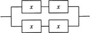
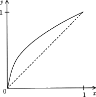
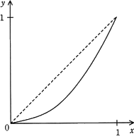
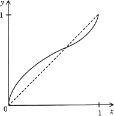
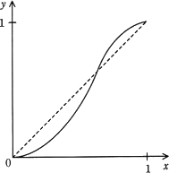

# [令和3年春期 午前 問14](https://www.ap-siken.com/kakomon/03_haru/q14.html)

#問題 #テクノロジ #システム構成要素 #システムの評価指標

解説を表示解説を隠す

<strong>問14</strong>　稼働率がxである装置を四つ組み合わせて，図のようなシステムを作ったときの稼働率をƒ(x)とする。区間 0≦x≦1 におけるy＝ƒ(x)の傾向を表すグラフはどれか。ここで，破線はy＝xのグラフである。 

<ul class="ap-choices">
<li class="ap-choice-item ap-wrong">

ア　

xが0に近い付近で y＝x より高い、または1に近い付近で y＝x より低い形状では、本問の ƒ(0.1)＜0.1・ƒ(0.9)＞0.9 とは一致しません。

</li>
<li class="ap-choice-item ap-wrong">

イ　

xが0に近い付近で y＝x より高い、または1に近い付近で y＝x より低い形状では、本問の ƒ(0.1)＜0.1・ƒ(0.9)＞0.9 とは一致しません。

</li>
<li class="ap-choice-item ap-wrong">

ウ　

xが0に近い付近で y＝x より高い、または1に近い付近で y＝x より低い形状では、本問の ƒ(0.1)＜0.1・ƒ(0.9)＞0.9 とは一致しません。

</li>
<li class="ap-choice-item ap-correct">

エ　

正しい。xが0に近い付近では ƒ(x)＜x、1に近い付近では ƒ(x)＞x となるグラフです。

</li>
</ul>

<h4>解説</h4>

<a href="用語/稼働率" class="internal-link" data-href="用語/稼働率">稼働率</a>xの機器が2台直列で接続されているときの全体の<a href="用語/稼働率" class="internal-link" data-href="用語/稼働率">稼働率</a>は「x²」、並列で接続されているときの<a href="用語/稼働率" class="internal-link" data-href="用語/稼働率">稼働率</a>は「1－(1－x)²」ですので、本システムの<a href="用語/稼働率" class="internal-link" data-href="用語/稼働率">稼働率</a>は以下の式で表すことができます。

1－(1－x²)²

各グラフの形状を見てみると、xが1に近いときと0に近いときの2つのケースでシステム全体の<a href="用語/稼働率" class="internal-link" data-href="用語/稼働率">稼働率</a>を計算すればどのグラフが適切であるか判断できるとわかります。仮に、xに0.9と0.1を使用して計算すると、

ƒ(0.9)＝1－(1－0.9²)²＝1－(1－0.81)²＝1－0.19²＝1－0.0361＝0.9639 ＞0.9

ƒ(0.1)＝1－(1－0.1²)²＝1－(1－0.01)²＝1－0.99²＝1－0.9801＝0.0199 ＜0.1

となるので、0に近い付近ではxよりも低い<a href="用語/稼働率" class="internal-link" data-href="用語/稼働率">稼働率</a>となり、1に近い付近ではxよりも高い<a href="用語/稼働率" class="internal-link" data-href="用語/稼働率">稼働率</a>となる「エ」のグラフが適切です。

