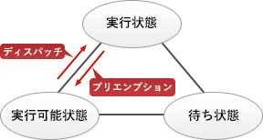

# [令和3年春期 午前 問17](https://www.ap-siken.com/kakomon/03_haru/q17.html)

#問題 #テクノロジ #ソフトウェア #オペレーティングシステム

解説を表示解説を隠す

<strong>問17</strong>　リアルタイムOSにおいて，実行中のタスクがプリエンプションによって遷移する状態はどれか。

<ul class="ap-choices">
<li class="ap-choice-item ap-wrong">

ア　休止状態

休止状態はタスクが一時停止した状態であり、プリエンプションで実行中のタスクが遷移する先ではない。

</li>
<li class="ap-choice-item ap-correct">

イ　実行可能状態

正しい。プリエンプションにより実行状態から実行可能状態へ遷移する。

</li>
<li class="ap-choice-item ap-wrong">

ウ　終了状態

終了状態はタスクの処理が完了した状態。プリエンプションでは<a href="用語/CPU" class="internal-link" data-href="用語/CPU">CPU</a>使用権が奪われただけで処理は継続可能。

</li>
<li class="ap-choice-item ap-wrong">

エ　待ち状態

待ち状態はI/O完了などのイベント待ちで遷移する状態。プリエンプションによる遷移先ではない。

</li>
</ul>

<h4>解説</h4>

プリエンプション（Preemption）とは、実行状態にあるタスクが<a href="用語/CPU" class="internal-link" data-href="用語/CPU">CPU</a>の使用権を奪われ実行可能状態に移されることをいいます。

プリエンプションは、次のいずれかの状態になると発生します。

<ul>
<li>実行状態のタスクより優先度の高いタスクが実行可能状態になる</li>
<li>実行状態のタスクに割り当てられた<a href="用語/CPU" class="internal-link" data-href="用語/CPU">CPU</a>使用時間が終了する</li>
</ul>

プリエンプションによって遷移する状態は「実行可能状態」です。したがって「イ」が正解です。OSが<a href="用語/CPU" class="internal-link" data-href="用語/CPU">CPU</a>やシステム資源を管理し、<a href="用語/CPU" class="internal-link" data-href="用語/CPU">CPU</a>使用時間や優先度などによって複数のタスクを実行状態や実行可能状態へ切替えながら実行していく<a href="用語/マルチタスク" class="internal-link" data-href="用語/マルチタスク">マルチタスク</a>方式をプリエンプション方式といいます。

