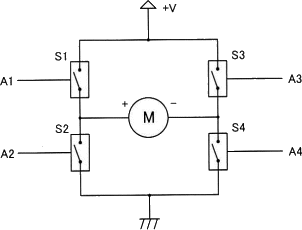
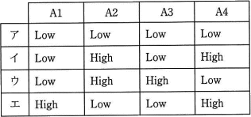
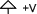
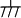
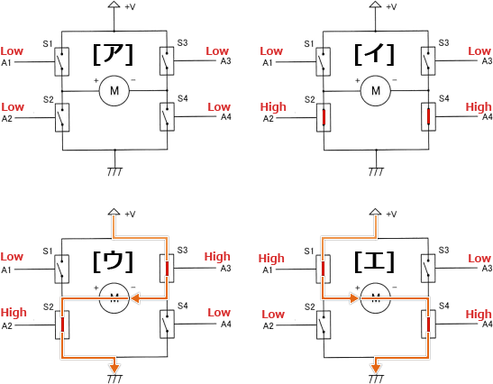

# [令和3年春期 午前 問23](https://www.ap-siken.com/kakomon/03_haru/q23.html)

#問題 #テクノロジ #ハードウェア

解説を表示解説を隠す

<strong>問23</strong>　図はDCモーターの正転逆転制御の動作原理を示す回路である。A1からA4の四つの制御信号の組合せの中で，モーターが逆転するものはどれか。ここで，モーターの＋端子から－端子に電流が流れるときモーターは正転し，S1からS4のそれぞれのスイッチ素子は，対応するA1からA4の制御信号がそれぞれHighのとき導通するものとする。  

<ul class="ap-choices">
<li class="ap-choice-item ap-wrong">

ア

モーターに電流が流れない組合せです。

</li>
<li class="ap-choice-item ap-wrong">

イ

モーターに電流が流れない組合せです。

</li>
<li class="ap-choice-item ap-correct">

ウ

正しい。モーターの－端子から＋端子へ電流が流れ，逆転します。

</li>
<li class="ap-choice-item ap-wrong">

エ

モーターの＋端子から－端子へ電流が流れるため，正転します。

</li>
</ul>

<h4>解説</h4>

図中の電源側は＋極、回路の基準電位はグランド（GND）の－極です。電気は＋極から－極へ流れます。

問題文のとおり，モーターの＋端子から－端子へ電流が流れるとき正転します。逆転させるには，モーターの－端子から＋端子へ電流を流す必要があります。本問のDCモーターは，<a href="用語/ブラシレスDCモーター" class="internal-link" data-href="用語/ブラシレスDCモーター">ブラシレスDCモーター</a>をはじめとする直流モーターで同様に，通電方向で回転方向が決まります。

各肢（ア〜エ）の電流の流れを確認すると，「ア」「イ」はモーターに電流が流れず，「エ」は＋端子から－端子へ流れるため正転です。「ウ」だけが－端子から＋端子へ流れる組合せなので，正解は「ウ」です。

