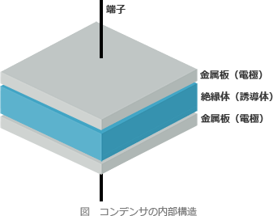

# [令和3年春期 午前 問24](https://www.ap-siken.com/kakomon/03_haru/q24.html)

#問題 #テクノロジ #ハードウェア

解説を表示解説を隠す

<strong>問24</strong>　コンデンサの機能として，適切なものはどれか。

<ul class="ap-choices">
<li class="ap-choice-item ap-correct">

ア　交流電流は通すが直流電流は通さない。

正しい。<a href="用語/コンデンサ" class="internal-link" data-href="用語/コンデンサ">コンデンサ</a>の機能です。

</li>
<li class="ap-choice-item ap-wrong">

イ　交流電流を直流電流に変換する。

AC/DCコンバータの機能です。

</li>
<li class="ap-choice-item ap-wrong">

ウ　直流電流は通すが交流電流は通さない。

<a href="用語/コイル" class="internal-link" data-href="用語/コイル">コイル</a>(インダクタ)の機能です。

</li>
<li class="ap-choice-item ap-wrong">

エ　直流電流を交流電流に変換する。

インバータの機能です。

</li>
</ul>

<h4>解説</h4>

<a href="用語/コンデンサ" class="internal-link" data-href="用語/コンデンサ">コンデンサ</a>は、内部に電気を蓄えたり、蓄えた電気を放出する電子部品です。真ん中の絶縁体を2つの金属板で挟むという基本構造になっていて、金属板に電圧を加えても絶縁体が電気を流さないので、金属板に電気が貯まる仕組みになっています。

<a href="用語/コンデンサ" class="internal-link" data-href="用語/コンデンサ">コンデンサ</a>は静電容量（電気を蓄えられる量）を超えるとそれ以上は電気を貯められないので、電流が流れなくなります。この仕組みにより直流電流を通しません。交流電流も絶縁体の中を通ることはできませんが、電流の向きが交互に変わるという交流の性質上、<a href="用語/コンデンサ" class="internal-link" data-href="用語/コンデンサ">コンデンサ</a>が充電と放電を繰り返すので実質的に電流が流れているのと同じになります。<a href="用語/DRAM" class="internal-link" data-href="用語/DRAM">DRAM</a>のメモリセルには<a href="用語/コンデンサ" class="internal-link" data-href="用語/コンデンサ">コンデンサ</a>が使用されていて、<a href="用語/コンデンサ" class="internal-link" data-href="用語/コンデンサ">コンデンサ</a>の電荷が高い状態を1、低い状態を0としてビット情報を保持しています。

