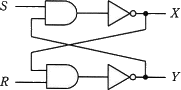
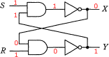
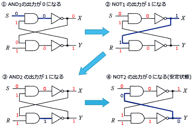
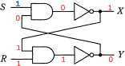

# [令和3年春期 午前 問25](https://www.ap-siken.com/kakomon/03_haru/q25.html)

#問題 #テクノロジ #ハードウェア

解説を表示解説を隠す

<strong>問25</strong>　図の論理回路において，S=1，R=1，X=0，Y=1のとき，Sを一旦0にした後，再び1に戻した。この操作を行った後のX，Yの値はどれか。 

<ul class="ap-choices">
<li class="ap-choice-item ap-wrong">

ア　X＝0，Y＝0

Sを0にしたあと安定した状態ではありません。

</li>
<li class="ap-choice-item ap-wrong">

イ　X＝0，Y＝1

操作前の初期状態です。Sを0→1としたあとの出力ではありません。

</li>
<li class="ap-choice-item ap-correct">

ウ　X＝1，Y＝0

正しい。Sを0にしたあと再び1に戻し，回路が安定したときの出力です。

</li>
<li class="ap-choice-item ap-wrong">

エ　X＝1，Y＝1

両出力が1の状態は本回路では安定しません。

</li>
</ul>

<h4>解説</h4>

図の論理回路は<a href="用語/フリップフロップ" class="internal-link" data-href="用語/フリップフロップ">フリップフロップ</a>と呼ばれ、2つの回路の安定した状態によって1<a href="用語/ビット" class="internal-link" data-href="用語/ビット">ビット</a>の情報を保持する回路です。現在と異なる入力が与えられると、次の入力があるまでその状態を保持しようとします。問題文の初期状態「S=1、R=1、X=0、Y=1」だと、回路は次のようになっています。

次にSを0に変えると、次のような状態になります。他方の出力がもう一方の入力に影響を与えるので、2つの回路が安定するまで何回か入出力を繰り返します。

そしてSを1に戻すと次のような状態になります。

回路はこの状態で安定するので、出力の値は「X＝1，Y＝0」となります。

