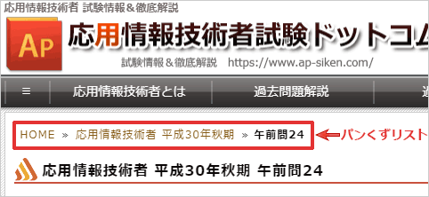

# [令和3年春期 午前 問26](https://www.ap-siken.com/kakomon/03_haru/q26.html)

#問題 #テクノロジ #ユーザーインタフェース #UX/UIデザイン

解説を表示解説を隠す

<strong>問26</strong>　利用者が現在閲覧しているWebページに表示する，Webサイトのトップページからそのページまでの経路情報を何と呼ぶか。

<ul class="ap-choices">
<li class="ap-choice-item ap-wrong">

ア　サイトマップ

これは<a href="用語/サイトマップ" class="internal-link" data-href="用語/サイトマップ">サイトマップ</a>の説明です。Webサイトのコンテンツを項目立てて一覧表示したものです。

</li>
<li class="ap-choice-item ap-wrong">

イ　スクロールバー

ウィンドウやHTML要素のサイズに収まらないページを閲覧するためのUI部品であり，トップから現ページまでの経路表示ではありません。

</li>
<li class="ap-choice-item ap-wrong">

ウ　ナビゲーションバー

詳細：<a href="用語/ナビゲーション" class="internal-link" data-href="用語/ナビゲーション">ナビゲーション</a>。コンテンツ誘導用のメニューUIであり，現在地までの階層経路の表示ではありません。

</li>
<li class="ap-choice-item ap-correct">

エ　パンくずリスト

正しい。トップページから現ページまでの経路を示し，各文字列がページへのリンクとして機能するUI部品です。

</li>
</ul>

<h4>解説</h4>

パンくずリスト(Breadcrumbs list)は、比較的大規模なWebサイトで、利用者が現在どこの階層のページにいるのかをユーザーに知らせ、現在位置を見失わないようにする目的で設置される<a href="用語/ユーザーインタフェース" class="internal-link" data-href="用語/ユーザーインタフェース">ユーザーインタフェース</a>(UI)部品です。各文字列がそれぞれのページへのハイパーリンクとして機能し、Webサイトの<a href="用語/ナビゲーション" class="internal-link" data-href="用語/ナビゲーション">ナビゲーション</a>を補助する役割を持っています。この「パンくずリスト」という名前は、童話「ヘンゼルとグレーテル」で主人公の男の子が森で迷わないように、通った道にパンくずを置いて行った話に由来しています。

<a href="用語/サイトマップ" class="internal-link" data-href="用語/サイトマップ">サイトマップ</a>は、Webサイトにあるコンテンツを項目立てて一覧表示したものです。利用者がどのようなコンテンツがあるのかを素早く認識でき、目的の情報にたどり着きやすくなる利点があります。

スクロールバーは、ウィンドウやHTML要素のサイズに収まらないページを閲覧するために使用されるUI部品です。

ナビゲーションバーは、Webサイトがどのようなコンテンツがあるかを知らせ、コンテンツへの誘導を促す<a href="用語/ナビゲーション" class="internal-link" data-href="用語/ナビゲーション">ナビゲーション</a>用のメニュー型UI部品です。サイト内で共通してページの固定位置に設置することで利用者を迷わせないメリットがあります。

したがって「エ」が正解です。

