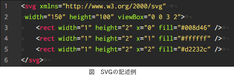

# [令和3年春期 午前 問27](https://www.ap-siken.com/kakomon/03_haru/q27.html)

#問題 #テクノロジ #情報メディア #マルチメディア技術

解説を表示解説を隠す

<strong>問27</strong>　W3Cで仕様が定義され，矩形や円，直線，文字列などの図形オブジェクトをXML形式で記述し，Webページでの図形描画にも使うことができる画像フォーマットはどれか。

<ul class="ap-choices">
<li class="ap-choice-item ap-wrong">

ア　OpenGL

2D／3D CGを扱うためのAPIであり，<a href="用語/XML" class="internal-link" data-href="用語/XML">XML</a>形式で図形を記述する画像フォーマットではない。

</li>
<li class="ap-choice-item ap-wrong">

イ　PNG

これは<a href="用語/PNG" class="internal-link" data-href="用語/PNG">PNG</a>の説明です。<a href="用語/可逆圧縮" class="internal-link" data-href="用語/可逆圧縮">可逆圧縮</a>のラスター画像フォーマットであり，本問の「<a href="用語/XML" class="internal-link" data-href="用語/XML">XML</a>形式で記述」には該当しない。

</li>
<li class="ap-choice-item ap-correct">

ウ　SVG

正しい。<a href="用語/SVG" class="internal-link" data-href="用語/SVG">SVG</a>は、<a href="用語/XML" class="internal-link" data-href="用語/XML">XML</a>形式で記述する画像フォーマットです。

</li>
<li class="ap-choice-item ap-wrong">

エ　TIFF

これは<a href="用語/TIFF" class="internal-link" data-href="用語/TIFF">TIFF</a>の説明です。複数の画像形式を1ファイルに格納できるファイル形式であり，本問の条件とは異なる。

</li>
</ul>

<h4>解説</h4>

<a href="用語/SVG" class="internal-link" data-href="用語/SVG">SVG</a>(Scalable Vector Graphics)は、ベクター形式による2次元の画像、図形、テキストなどを<a href="用語/XML" class="internal-link" data-href="用語/XML">XML</a>形式で記述する画像フォーマットです。

<a href="用語/SVG" class="internal-link" data-href="用語/SVG">SVG</a>は画像をテキストベースで定義するため、次のような特徴があります。

<ul>
<li>拡大・縮小による画質の劣化が生じない（スマートフォンなどの高解像度ディスプレイに最適）</li>
<li>画像編集専用ソフトウェアを用いずに、テキストエディタでも直接編集が可能</li>
<li>JavaScriptなどのスクリプト言語を用いて動的な制御が可能</li>
</ul>

<a href="用語/SVG" class="internal-link" data-href="用語/SVG">SVG</a>は、比較的構造が単純で再利用されやすい画像や、インタラクティブ性を必要とする画像に多く活用されています。具体的には、アイコン、ロゴ、ボタン、チャート、グラフ、地図、ダイアグラムなどが挙げられます。これらの用途では、ラスター画像（<a href="用語/JPEG" class="internal-link" data-href="用語/JPEG">JPEG</a>や<a href="用語/PNG" class="internal-link" data-href="用語/PNG">PNG</a>など）に比べてデータサイズが小さく、通信量や表示速度の観点からも有利です。HTML5でインライン<a href="用語/SVG" class="internal-link" data-href="用語/SVG">SVG</a>がサポートされたことにより、Webページでの<a href="用語/SVG" class="internal-link" data-href="用語/SVG">SVG</a>の活用が広がっています。

Open Graphics Libraryの略。Linux、FreeBSDなどのPC UNIXに加え、Windows、Mac OS X等クロスプラットフォームで使用できる2D／3DCGを扱うためのAPIです。

Portable Network Graphicsの略。圧縮による画質の劣化のない<a href="用語/可逆圧縮" class="internal-link" data-href="用語/可逆圧縮">可逆圧縮</a>の画像ファイルフォーマットで、<a href="用語/GIF" class="internal-link" data-href="用語/GIF">GIF</a>よりも圧縮率が高く、現在ではほぼすべてのブラウザでサポートされているためWebページの画像フォーマットとして使用されます。

Tagged Image File Formatの略。画像データを解像度・色数・カラーモデルなどが異なる複数の形式で1つのファイルに格納できるファイル形式です。

