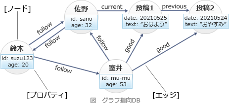

# [令和3年春期 午前 問28](https://www.ap-siken.com/kakomon/03_haru/q28.html)

#問題 #テクノロジ #データベース #データベース応用

解説を表示解説を隠す

<strong>問28</strong>　NoSQLの一種である，グラフ指向DBの特徴として，適切なものはどれか。

<ul class="ap-choices">
<li class="ap-choice-item ap-wrong">

ア　データ項目の値として階層構造のデータをドキュメントとしてもつことができる。また，ドキュメントに対しインデックスを作成することもできる。

これは<a href="用語/ドキュメント指向データベース" class="internal-link" data-href="用語/ドキュメント指向データベース">ドキュメント指向データベース</a>の説明です。

</li>
<li class="ap-choice-item ap-correct">

イ　ノード，リレーション，プロパティで構成され，ノード間をリレーションでつないで構造化する。ノード及びリレーションはプロパティをもつことができる。

正しい。<a href="用語/グラフデータベース" class="internal-link" data-href="用語/グラフデータベース">グラフデータベース</a>の説明です。

</li>
<li class="ap-choice-item ap-wrong">

ウ　一つのキーに対して一つの値をとる形をしている。値の型は定義されていないので，様々な型の値を格納することができる。

これは<a href="用語/キーバリュー型データベース" class="internal-link" data-href="用語/キーバリュー型データベース">キーバリュー型データベース</a>の説明です。

</li>
<li class="ap-choice-item ap-wrong">

エ　一つのキーに対して複数の列をとる形をしている。関係データベースとは異なり，列の型は固定されていない。

これは<a href="用語/列指向データベース" class="internal-link" data-href="用語/列指向データベース">列指向データベース</a>の説明です。

</li>
</ul>

<h4>解説</h4>

グラフ指向DBは、<a href="用語/有向グラフ" class="internal-link" data-href="用語/有向グラフ">有向グラフ</a>と呼ばれる<a href="用語/データ構造" class="internal-link" data-href="用語/データ構造">データ構造</a>でデータを格納するデータベースで、データエンティティ（実体）を表す「ノード」、ノード間の関連をタイプと方向をもって表す「エッジ」、ノードとエッジの属性情報を key-value 形式で保持する「プロパティ」の3要素で構成されます。SNSにおけるユーザーの関係やWebサイト同士のリンク構造などの高度な「つながり」を表すデータモデルに適しています。

選択肢の「リレーション」は、解説でいうノード間の関連を表す「エッジ」に相当します。アはドキュメント指向DB、ウはキーバリューストア（KVS）、エはカラム（列）指向DBの特徴です。したがって正解は「イ」です。

