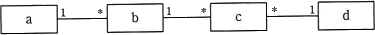
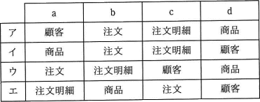

# [令和3年春期 午前 問29](https://www.ap-siken.com/kakomon/03_haru/q29.html)

#問題 #テクノロジ #データベース #データベース設計

解説を表示解説を隠す

<strong>問29</strong>　商品の注文を記録するクラス(顧客，商品，注文，注文明細)の構造を概念データモデルで表現する。a～dに入れるべきクラス名の組合せはどれか。ここで，顧客は何度も注文を行い，一度に一つ以上の商品を注文でき，注文明細はそれぞれ1種類の商品に対応している。また，モデルの表記にはUMLを用いる。  

<ul class="ap-choices">
<li class="ap-choice-item ap-correct">

ア

正しい。顧客(1)－(多)注文(1)－(多)注文明細(多)－(1)商品の<a href="用語/関連" class="internal-link" data-href="用語/関連">関連</a>が設問の条件と一致します。

</li>
<li class="ap-choice-item ap-wrong">

イ

<a href="用語/クラス" class="internal-link" data-href="用語/クラス">クラス</a>名の割当または<a href="用語/関連" class="internal-link" data-href="用語/関連">関連</a>の多重度が、設問の条件から導かれる組合せと一致しません。

</li>
<li class="ap-choice-item ap-wrong">

ウ

<a href="用語/クラス" class="internal-link" data-href="用語/クラス">クラス</a>名の割当または<a href="用語/関連" class="internal-link" data-href="用語/関連">関連</a>の多重度が、設問の条件から導かれる組合せと一致しません。

</li>
<li class="ap-choice-item ap-wrong">

エ

<a href="用語/クラス" class="internal-link" data-href="用語/クラス">クラス</a>名の割当または<a href="用語/関連" class="internal-link" data-href="用語/関連">関連</a>の多重度が、設問の条件から導かれる組合せと一致しません。

</li>
</ul>

<h4>解説</h4>

設問の文章から以下の関係を導くことができます。「顧客は何度も注文を行い」→1人の顧客について複数（0つ以上）の注文が存在し、1つの注文は1人の顧客によって行われるので、顧客<a href="用語/クラス" class="internal-link" data-href="用語/クラス">クラス</a>と注文<a href="用語/クラス" class="internal-link" data-href="用語/クラス">クラス</a>の関係は「1対多」となります。「一度に一つ以上の商品を注文でき」→1つの注文<a href="用語/エンティティ" class="internal-link" data-href="用語/エンティティ">エンティティ</a>について、1つ以上の注文明細<a href="用語/エンティティ" class="internal-link" data-href="用語/エンティティ">エンティティ</a>が存在するので、注文<a href="用語/クラス" class="internal-link" data-href="用語/クラス">クラス</a>と注文明細<a href="用語/クラス" class="internal-link" data-href="用語/クラス">クラス</a>の関係は「1対多」となります。「注文明細はそれぞれ1種類の商品に対応している」→1つの注文明細は1種類の商品に対応し、1種類の商品は複数の注文明細に<a href="用語/関連" class="internal-link" data-href="用語/関連">関連</a>し得るので、注文明細<a href="用語/クラス" class="internal-link" data-href="用語/クラス">クラス</a>と商品<a href="用語/クラス" class="internal-link" data-href="用語/クラス">クラス</a>の関係は「多対1」となります。以上を整理すると、データ間の<a href="用語/関連" class="internal-link" data-href="用語/関連">関連</a>を適切に表すのは次の<a href="用語/概念データモデル" class="internal-link" data-href="用語/概念データモデル">概念データモデル</a>です。 顧客(1)－(多)注文(1)－(多)注文明細(多)－(1)商品したがって「ア」の組合せが適切となります。

