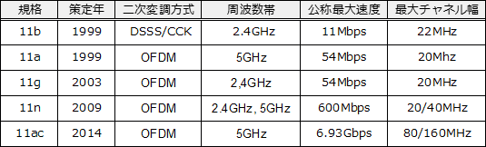
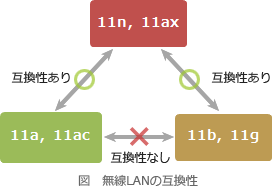

# [令和3年春期 午前 問33](https://www.ap-siken.com/kakomon/03_haru/q33.html)

#問題 #テクノロジ #ネットワーク #通信プロトコル

解説を表示解説を隠す

<strong>問33</strong>　日本国内において，無線LANの規格IEEE802.11acに関する説明のうち，適切なものはどれか。

<ul class="ap-choices">
<li class="ap-choice-item ap-wrong">

ア　IEEE802.11gに対応している端末はIEEE802.11acに対応しているアクセスポイントと通信が可能である。

11gは2.4GHz帯のみ、11acは5GHz帯のみを使用するため<a href="用語/互換性" class="internal-link" data-href="用語/互換性">互換性</a>はありません。

</li>
<li class="ap-choice-item ap-wrong">

イ　最大通信速度は600Mビット／秒である。

11acの最大通信速度は6.93Gbpsです。600Mbpsは11nの最大通信速度です。

</li>
<li class="ap-choice-item ap-wrong">

ウ　使用するアクセス制御方式はCSMA/CD方式である。

<a href="用語/CSMA/CD" class="internal-link" data-href="用語/CSMA/CD">CSMA/CD</a>（衝突検出）は有線<a href="用語/LAN" class="internal-link" data-href="用語/LAN">LAN</a>の<a href="用語/アクセス制御" class="internal-link" data-href="用語/アクセス制御">アクセス制御</a>方式です。無線<a href="用語/LAN" class="internal-link" data-href="用語/LAN">LAN</a>は<a href="用語/CSMA/CA" class="internal-link" data-href="用語/CSMA/CA">CSMA/CA</a>（衝突回避）です。

</li>
<li class="ap-choice-item ap-correct">

エ　使用する周波数帯は5GHz帯である。

正しい。11acは5GHz帯のみを使用します。

</li>
</ul>

<h4>解説</h4>

下表は無線<a href="用語/LAN" class="internal-link" data-href="用語/LAN">LAN</a>標準規格であるIEEE 802.11b/a/g/n/acの主な特徴を比較したものです。

11gは2.4GHz帯のみを使用し、11acは5GHz帯のみを使用するので<a href="用語/互換性" class="internal-link" data-href="用語/互換性">互換性</a>はありません。

11acの最大通信速度は6.93Gbpsです。600Mbpsは11nの最大通信速度です。

<a href="用語/CSMA/CD" class="internal-link" data-href="用語/CSMA/CD">CSMA/CD</a>(衝突検出)は有線<a href="用語/LAN" class="internal-link" data-href="用語/LAN">LAN</a>の<a href="用語/アクセス制御" class="internal-link" data-href="用語/アクセス制御">アクセス制御</a>方式です。無線<a href="用語/LAN" class="internal-link" data-href="用語/LAN">LAN</a>は<a href="用語/CSMA/CA" class="internal-link" data-href="用語/CSMA/CA">CSMA/CA</a>(衝突回避)です。

正しい。11acは5GHz帯のみを使用します。

