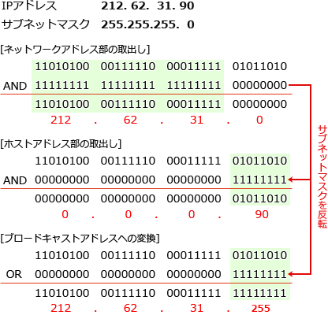

# [令和3年春期 午前 問34](https://www.ap-siken.com/kakomon/03_haru/q34.html)

#問題 #テクノロジ #ネットワーク #通信プロトコル

解説を表示解説を隠す

<strong>問34</strong>　IPv4ネットワークで使用されるIPアドレスaとサブネットマスクmからホストアドレスを求める式はどれか。ここで，"～"はビット反転の演算子，"｜"はビットごとの論理和の演算子，"＆"はビットごとの論理積の演算子を表し，ビット反転の演算子の優先順位は論理和，論理積の演算子よりも高いものとする。

<ul class="ap-choices">
<li class="ap-choice-item ap-wrong">

ア　～a＆m

<a href="用語/IPアドレス" class="internal-link" data-href="用語/IPアドレス">IPアドレス</a>を反転してマスクと<a href="用語/論理積" class="internal-link" data-href="用語/論理積">論理積</a>をとっても、ホスト部を取り出す式にはなりません。

</li>
<li class="ap-choice-item ap-wrong">

イ　～a｜m

<a href="用語/IPアドレス" class="internal-link" data-href="用語/IPアドレス">IPアドレス</a>を反転してマスクと<a href="用語/論理和" class="internal-link" data-href="用語/論理和">論理和</a>をとっても、ホスト部を<a href="用語/ビット" class="internal-link" data-href="用語/ビット">ビット</a>マスクで取り出す操作にはなりません。

</li>
<li class="ap-choice-item ap-correct">

ウ　a＆～m

正しい。<a href="用語/サブネットマスク" class="internal-link" data-href="用語/サブネットマスク">サブネットマスク</a>を反転した<a href="用語/ビット" class="internal-link" data-href="用語/ビット">ビット</a>マスクと<a href="用語/IPアドレス" class="internal-link" data-href="用語/IPアドレス">IPアドレス</a>の<a href="用語/論理積" class="internal-link" data-href="用語/論理積">論理積</a>で、ホスト部の<a href="用語/ビット" class="internal-link" data-href="用語/ビット">ビット</a>を取り出します。

</li>
<li class="ap-choice-item ap-wrong">

エ　a｜～m

<a href="用語/論理和" class="internal-link" data-href="用語/論理和">論理和</a>では<a href="用語/ビット" class="internal-link" data-href="用語/ビット">ビット</a>マスクによる特定範囲の取り出しにならず、ホストアドレスを得る式ではありません。

</li>
</ul>

<h4>解説</h4>

<a href="用語/サブネットマスク" class="internal-link" data-href="用語/サブネットマスク">サブネットマスク</a>はネットワーク部の<a href="用語/ビット" class="internal-link" data-href="用語/ビット">ビット</a>が「1」、ホストアドレス部が「0」になっている<a href="用語/ビット" class="internal-link" data-href="用語/ビット">ビット</a>列です。通常<a href="用語/サブネットマスク" class="internal-link" data-href="用語/サブネットマスク">サブネットマスク</a>はネットワークアドレスを取り出すために使用されますが、この<a href="用語/ビット" class="internal-link" data-href="用語/ビット">ビット</a>を反転させると逆にホストアドレス部を取り出すための<a href="用語/ビット" class="internal-link" data-href="用語/ビット">ビット</a>マスクとなることがわかります。ある<a href="用語/ビット" class="internal-link" data-href="用語/ビット">ビット</a>列から特定範囲の<a href="用語/ビット" class="internal-link" data-href="用語/ビット">ビット</a>を取り出すには、取り出す位置の<a href="用語/ビット" class="internal-link" data-href="用語/ビット">ビット</a>を「1」とした<a href="用語/ビット" class="internal-link" data-href="用語/ビット">ビット</a>マスクとの<a href="用語/論理積" class="internal-link" data-href="用語/論理積">論理積</a>(AND)をとるので、ホストアドレス部を取り出すためには<a href="用語/サブネットマスク" class="internal-link" data-href="用語/サブネットマスク">サブネットマスク</a>を反転させた<a href="用語/ビット" class="internal-link" data-href="用語/ビット">ビット</a>列と<a href="用語/IPアドレス" class="internal-link" data-href="用語/IPアドレス">IPアドレス</a>の<a href="用語/論理積" class="internal-link" data-href="用語/論理積">論理積</a>を求めます。<a href="用語/IPアドレス" class="internal-link" data-href="用語/IPアドレス">IPアドレス</a>が「a」、サブネット(m)を反転させたものが「～m」、<a href="用語/論理積" class="internal-link" data-href="用語/論理積">論理積</a>が「＆」なので、正しい式は「a＆～m」です。

