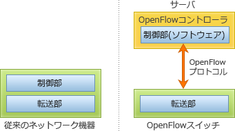

# [令和3年春期 午前 問35](https://www.ap-siken.com/kakomon/03_haru/q35.html)

#問題 #テクノロジ #ネットワーク #ネットワーク管理

解説を表示解説を隠す

<strong>問35</strong>　ONF(Open Networking Foundation)が標準化を進めているOpenFlowプロトコルを用いたSDN(Software-Defined Networking)の説明として，適切なものはどれか。

<ul class="ap-choices">
<li class="ap-choice-item ap-wrong">

ア　管理ステーションから定期的にネットワーク機器のMIB(Management Information Base)情報を取得して，稼働監視や性能管理を行うためのネットワーク管理手法

これは<a href="用語/SNMP管理ステーション" class="internal-link" data-href="用語/SNMP管理ステーション">SNMP管理ステーション</a>と<a href="用語/MIB" class="internal-link" data-href="用語/MIB">MIB</a>によるネットワーク管理の説明です。

</li>
<li class="ap-choice-item ap-wrong">

イ　データ転送機能をもつネットワーク機器同士が経路情報を交換して，ネットワーク全体のデータ転送経路を決定する方式

従来の<a href="用語/ルーティング制御" class="internal-link" data-href="用語/ルーティング制御">ルーティング制御</a>の仕組みです。

</li>
<li class="ap-choice-item ap-wrong">

ウ　ネットワーク制御機能とデータ転送機能を実装したソフトウェアを，仮想環境で利用するための技術

これはネットワーク<a href="用語/仮想化" class="internal-link" data-href="用語/仮想化">仮想化</a>(VNF:Virtual Network Function)の説明です。

</li>
<li class="ap-choice-item ap-correct">

エ　ネットワーク制御機能とデータ転送機能を論理的に分離し，コントローラーと呼ばれるソフトウェアで，データ転送機能をもつネットワーク機器の集中制御を可能とするアーキテクチャ

正しい。<a href="用語/SDN" class="internal-link" data-href="用語/SDN">SDN</a>の説明です。

</li>
</ul>

<h4>解説</h4>

<a href="用語/SDN" class="internal-link" data-href="用語/SDN">SDN</a>(Software-Defined Networking)は、ソフトウェア制御によって物理的な<a href="用語/ネットワーク構成" class="internal-link" data-href="用語/ネットワーク構成">ネットワーク構成</a>にとらわれない動的で柔軟なネットワークを実現する技術全般を意味します。<a href="用語/SDN" class="internal-link" data-href="用語/SDN">SDN</a>を実現するための技術標準が<a href="用語/OpenFlow" class="internal-link" data-href="用語/OpenFlow">OpenFlow</a>プロトコルであり、既存のネットワーク機器がもつ制御処理(コントロールプレーン)と転送処理(データプレーン)を分離することで、<a href="用語/OpenFlow" class="internal-link" data-href="用語/OpenFlow">OpenFlow</a>コントローラーが中央集権的に複数のスイッチの転送制御を管理します。<a href="用語/OpenFlow" class="internal-link" data-href="用語/OpenFlow">OpenFlow</a>では<a href="用語/パケット" class="internal-link" data-href="用語/パケット">パケット</a>や<a href="用語/フレーム" class="internal-link" data-href="用語/フレーム">フレーム</a>をフローとして扱い、フローの様々な情報を使って柔軟に転送制御できるようになっています。スイッチは<a href="用語/OpenFlow" class="internal-link" data-href="用語/OpenFlow">OpenFlow</a>コントローラーと通信を行いながら、<a href="用語/OpenFlow" class="internal-link" data-href="用語/OpenFlow">OpenFlow</a>コントローラーから提供されるフローテーブルや直接の転送指示により転送先を判断します。

