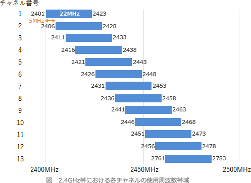

# [令和3年春期 午前 問36](https://www.ap-siken.com/kakomon/03_haru/q36.html)

#問題 #テクノロジ #ネットワーク #ネットワーク方式

解説を表示解説を隠す

<strong>問36</strong>　2.4GHz帯の無線LANのアクセスポイントを，広いオフィスや店舗などをカバーできるように分散して複数設置したい。2.4GHz帯の無線LANの特性を考慮した運用をするために，各アクセスポイントが使用する周波数チャネル番号の割当て方として，適切なものはどれか。

<ul class="ap-choices">
<li class="ap-choice-item ap-wrong">

ア　PCを移動しても，PCの設定を変えずに近くのアクセスポイントに接続できるように，全てのアクセスポイントが使用する周波数チャネル番号は同じ番号に揃えておくのがよい。

移動時に他のアクセスポイントへ接続する機能は<a href="用語/ハンドオーバー" class="internal-link" data-href="用語/ハンドオーバー">ハンドオーバー</a>であり，端末は全<a href="用語/チャネル" class="internal-link" data-href="用語/チャネル">チャネル</a>をスキャンするため同一<a href="用語/チャネル" class="internal-link" data-href="用語/チャネル">チャネル</a>番号である必要はありません。同一<a href="用語/チャネル" class="internal-link" data-href="用語/チャネル">チャネル</a>に揃えると電波干渉で通信が不安定になります。

</li>
<li class="ap-choice-item ap-correct">

イ　アクセスポイント相互の電波の干渉を避けるために，隣り合うアクセスポイントには，例えば周波数チャネル番号1と6，6と11のように離れた番号を割り当てるのがよい。

正しい。2.4GHz帯では<a href="用語/チャネル" class="internal-link" data-href="用語/チャネル">チャネル</a>が5つ以上離れていないと電波干渉が起こるため，通信範囲が重なるアクセスポイントには1・6・11など離れた番号を割り当てます。

</li>
<li class="ap-choice-item ap-wrong">

ウ　異なるSSIDの通信が相互に影響することはないので，アクセスポイントごとにSSIDを変えて，かつ，周波数チャネル番号の割当ては機器の出荷時設定のままがよい。

<a href="用語/SSID" class="internal-link" data-href="用語/SSID">SSID</a>が異なれば混信は起こりませんが，周波数帯による電波干渉は避けられません。初期設定のままでは同一<a href="用語/チャネル" class="internal-link" data-href="用語/チャネル">チャネル</a>になり通信が不安定になるおそれがあります。

</li>
<li class="ap-choice-item ap-wrong">

エ　障害時に周波数チャネル番号から対象のアクセスポイントを特定するために，設置エリアの端から1，2，3と順番に使用する周波数チャネル番号を割り当てるのがよい。

隣り合うネットワークに近接する<a href="用語/チャネル" class="internal-link" data-href="用語/チャネル">チャネル</a>番号を設定することになり，電波干渉で通信が不安定になるおそれがあります。

</li>
</ul>

<h4>解説</h4>

無線LANネットワークでは、近接するネットワークとの電波干渉を避けるために、使用する周波数帯をネットワークごとに微妙にずらすことが可能になっています。このときに設定する値を<a href="用語/チャネル" class="internal-link" data-href="用語/チャネル">チャネル</a>（チャンネル）といいます。2.4GHz帯を使用するIEEE802.11gでは1～13の<a href="用語/チャネル" class="internal-link" data-href="用語/チャネル">チャネル</a>（11bでは1～14）を選択できますが、1つの<a href="用語/チャネル" class="internal-link" data-href="用語/チャネル">チャネル</a>の周波数帯域は22MHz、各<a href="用語/チャネル" class="internal-link" data-href="用語/チャネル">チャネル</a>は5MHzずつ区切られているので、近接する<a href="用語/チャネル" class="internal-link" data-href="用語/チャネル">チャネル</a>同士は周波数帯が一部重なっていて電波干渉が起きます。このため、近くの無線LANネットワークで同じまたは近接する<a href="用語/チャネル" class="internal-link" data-href="用語/チャネル">チャネル</a>が使用されていると通信が不安定になってしまうという特性があります。なお、5GHz帯を使用する無線LAN規格では各<a href="用語/チャネル" class="internal-link" data-href="用語/チャネル">チャネル</a>の周波数帯は完全に独立しているので、近接する<a href="用語/チャネル" class="internal-link" data-href="用語/チャネル">チャネル</a>を設定しても2.4GHz帯のような電波干渉は起きません。

無線LANを利用している端末が移動した際、シームレスに他のアクセスポイントに接続できる機能を<a href="用語/ハンドオーバー" class="internal-link" data-href="用語/ハンドオーバー">ハンドオーバー</a>といいます。<a href="用語/ハンドオーバー" class="internal-link" data-href="用語/ハンドオーバー">ハンドオーバー</a>時は端末が全<a href="用語/チャネル" class="internal-link" data-href="用語/チャネル">チャネル</a>のスキャンを行ってアクセスポイントを検出するので、同じ<a href="用語/チャネル" class="internal-link" data-href="用語/チャネル">チャネル</a>番号である必要はありません。2.4GHz帯では<a href="用語/チャネル" class="internal-link" data-href="用語/チャネル">チャネル</a>が5つ以上離れていないと電波干渉が起こるので、通信範囲が重なり合うアクセスポイントには、1、6、11などの離れた番号を割り当てる必要があります。<a href="用語/SSID" class="internal-link" data-href="用語/SSID">SSID</a>が異なれば混信（意図しないアクセスポイントに接続してしまうこと）は起こりませんが、使用する周波数帯によって生じる電波干渉は避けられません。機器の初期設定は同一の値になっていることが多いので、そのままの設定で使用すると通信が不安定になるおそれがあります。隣り合うネットワークに近接する<a href="用語/チャネル" class="internal-link" data-href="用語/チャネル">チャネル</a>番号を設定することになるので、電波干渉が起こり、通信が不安定になるおそれがあります。

