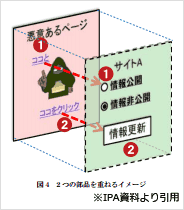

# [令和3年春期 午前 問37](https://www.ap-siken.com/kakomon/03_haru/q37.html)

#問題 #テクノロジ #セキュリティ #セキュリティ実装技術

解説を表示解説を隠す

<strong>問37</strong>　Webサイトにおいて，クリックジャッキング攻撃の対策に該当するものはどれか。

<ul class="ap-choices">
<li class="ap-choice-item ap-wrong">

ア　HTTPレスポンスヘッダーにX-Content-Type-Optionsを設定する。

これは<a href="用語/クロスサイトスクリプティング" class="internal-link" data-href="用語/クロスサイトスクリプティング">クロスサイトスクリプティング</a>への対策（<a href="用語/MIME" class="internal-link" data-href="用語/MIME">MIME</a>スニッフィング防止用の<a href="用語/HTTP" class="internal-link" data-href="用語/HTTP">HTTP</a>ヘッダー）の説明です。

</li>
<li class="ap-choice-item ap-correct">

イ　HTTPレスポンスヘッダーにX-Frame-Optionsを設定する。

正しい。詳細：<a href="用語/クリックジャッキング" class="internal-link" data-href="用語/クリックジャッキング">クリックジャッキング</a>

</li>
<li class="ap-choice-item ap-wrong">

ウ　入力にHTMLタグが含まれていたら，HTMLタグとして解釈されないほかの文字列に置き換える。

これは<a href="用語/クロスサイトスクリプティング対策" class="internal-link" data-href="用語/クロスサイトスクリプティング対策">クロスサイトスクリプティング対策</a>（入力値のサニタイジング）の説明です。

</li>
<li class="ap-choice-item ap-wrong">

エ　入力文字数が制限を超えているときは受け付けない。

これは<a href="用語/バッファオーバーフロー攻撃" class="internal-link" data-href="用語/バッファオーバーフロー攻撃">バッファオーバーフロー攻撃</a>への対策（入力長の制限）の説明です。

</li>
</ul>

<h4>解説</h4>

<a href="用語/クリックジャッキング" class="internal-link" data-href="用語/クリックジャッキング">クリックジャッキング</a>は、攻撃者が用意したWebページの前面に透明化した別のWebページを重ねることでユーザーを視覚的にだまし、正常に視認できるWebページ上をクリックさせることで、透明化したWebページのコンテンツを操作させる攻撃です。ユーザーのクリックを奪うという攻撃の特徴からクリック・ジャッキングと呼ばれます。

「X-Content-Type-Options」は、ブラウザによる<a href="用語/MIME" class="internal-link" data-href="用語/MIME">MIME</a>スニッフィングの有効・無効を指示するための<a href="用語/HTTP" class="internal-link" data-href="用語/HTTP">HTTP</a>ヘッダーで、値として「nosniff」を指定することが<a href="用語/クロスサイトスクリプティング" class="internal-link" data-href="用語/クロスサイトスクリプティング">クロスサイトスクリプティング</a>への対策になります。<a href="用語/MIME" class="internal-link" data-href="用語/MIME">MIME</a>スニッフィングとは、<a href="用語/Webサーバ" class="internal-link" data-href="用語/Webサーバ">Webサーバ</a>から<a href="用語/MIME" class="internal-link" data-href="用語/MIME">MIME</a>タイプ（メディアの種類）が指定されないなどの理由でリソースの<a href="用語/MIME" class="internal-link" data-href="用語/MIME">MIME</a>タイプが不明なとき、ブラウザがリソースのバイトストリームを調べ、<a href="用語/MIME" class="internal-link" data-href="用語/MIME">MIME</a>タイプを推定する機能です。これが有効になっていると、攻撃者がJSONや画像内に埋め込んだスクリプトを不正に実行してしまうおそれがあります。これを防止するためのヘッダーが「X-Content-Type-Options」です。

正しい。「X-Frame-Options」は、<a href="用語/フレーム" class="internal-link" data-href="用語/フレーム">フレーム</a>要素（&lt;frame&gt; または &lt;iframe&gt;）を使用したコンテンツ表示を許可するかどうか指示するための<a href="用語/HTTP" class="internal-link" data-href="用語/HTTP">HTTP</a>ヘッダーで、値として「DENY（拒否）」または「SAMEORIGIN」を指定することが<a href="用語/クリックジャッキング" class="internal-link" data-href="用語/クリックジャッキング">クリックジャッキング</a>攻撃への対策となります。<a href="用語/クリックジャッキング" class="internal-link" data-href="用語/クリックジャッキング">クリックジャッキング</a>攻撃は、別サイトのHTMLを<a href="用語/フレーム" class="internal-link" data-href="用語/フレーム">フレーム</a>要素で読込み、それを透明化して罠サイトの上に重ね合わせるため、<a href="用語/フレーム" class="internal-link" data-href="用語/フレーム">フレーム</a>要素を使用した他サイトの表示を禁止すれば防ぐことができます。

「ウ」は<a href="用語/クロスサイトスクリプティング" class="internal-link" data-href="用語/クロスサイトスクリプティング">クロスサイトスクリプティング</a>への対策です。入力値に含まれる特殊文字を無害化する処理をサニタイジングと言います。

「エ」は<a href="用語/バッファオーバーフロー攻撃" class="internal-link" data-href="用語/バッファオーバーフロー攻撃">バッファオーバーフロー攻撃</a>への対策です。

したがって「イ」が正解です。

