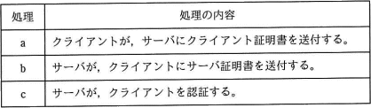
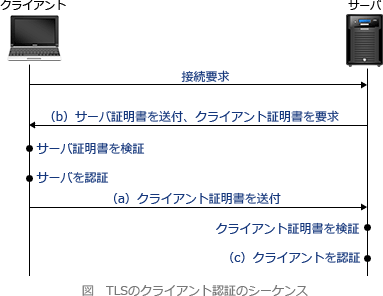

# [令和3年春期 午前 問45](https://www.ap-siken.com/kakomon/03_haru/q45.html)

#問題 #テクノロジ #セキュリティ #セキュリティ実装技術

解説を表示解説を隠す

<strong>問45</strong>　TLSのクライアント認証における次の処理a～cについて，適切な順序はどれか。 a　クライアントは，サーバにクライアント証明書を送付する。 b　サーバは，クライアントにサーバ証明書を送付するときに，クライアント証明書の提示を要請する。 c　サーバは，クライアント証明書を検証して，クライアントを認証する。 

<ul class="ap-choices">
<li class="ap-choice-item ap-wrong">

ア　a → b → c

<a href="用語/クライアント証明書" class="internal-link" data-href="用語/クライアント証明書">クライアント証明書</a>の送付（a）より前に，サーバによる提示要請（b）が行われる必要があります。

</li>
<li class="ap-choice-item ap-wrong">

イ　a → c → b

サーバによる検証（c）は，<a href="用語/クライアント証明書" class="internal-link" data-href="用語/クライアント証明書">クライアント証明書</a>の送付（a）の後です。提示要請（b）は送付より前です。

</li>
<li class="ap-choice-item ap-correct">

ウ　b → a → c

正しい。提示要請（b）→送付（a）→検証（c）の順序がTLSのクライアント<a href="用語/認証" class="internal-link" data-href="用語/認証">認証</a>の流れです。

</li>
<li class="ap-choice-item ap-wrong">

エ　c → a → b

検証（c）は<a href="用語/クライアント証明書" class="internal-link" data-href="用語/クライアント証明書">クライアント証明書</a>の送付（a）の後です。提示要請（b）は最初の段階です。

</li>
</ul>

<h4>解説</h4>

TLSでは、サーバ<a href="用語/認証" class="internal-link" data-href="用語/認証">認証</a>の終了後、オプションで<a href="用語/クライアント証明書" class="internal-link" data-href="用語/クライアント証明書">クライアント証明書</a>によるクライアント<a href="用語/認証" class="internal-link" data-href="用語/認証">認証</a>を行う機能があります。クライアント<a href="用語/認証" class="internal-link" data-href="用語/認証">認証</a>を実施する際の、クライアントとサーバの間のメッセージのやり取りとしては以下の手順となります。

1. サーバは、クライアントに<a href="用語/サーバ証明書" class="internal-link" data-href="用語/サーバ証明書">サーバ証明書</a>を送付するときに、<a href="用語/クライアント証明書" class="internal-link" data-href="用語/クライアント証明書">クライアント証明書</a>の提示を要請する（b） 2. クライアントは、サーバに<a href="用語/クライアント証明書" class="internal-link" data-href="用語/クライアント証明書">クライアント証明書</a>を送付する（a） 3. サーバは、<a href="用語/クライアント証明書" class="internal-link" data-href="用語/クライアント証明書">クライアント証明書</a>を検証して、クライアントを<a href="用語/認証" class="internal-link" data-href="用語/認証">認証</a>する（c）

したがって「b → a → c」の手順が適切です。

