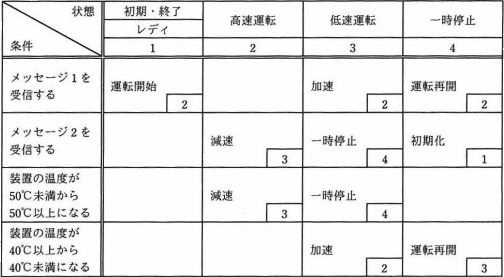
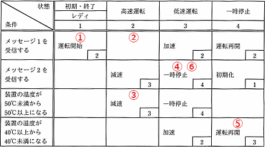

# [令和3年春期 午前 問47](https://www.ap-siken.com/kakomon/03_haru/q47.html)

#問題 #テクノロジ #システム開発技術 #設計

解説を表示解説を隠す

<strong>問47</strong>　状態遷移表のとおりに動作し，運転状況に応じて装置の温度が上下するシステムがある。システムの状態が"レディ"のとき，①～⑥の順にイベントが発生すると，最後の状態はどれになるか。ここで，状態遷移表の空欄は状態が変化しないことを表す。〔状態遷移表〕〔発生するイベント〕① メッセージ1を受信する。② メッセージ1を受信する。③ 装置の温度が50℃以上になる。④ メッセージ2を受信する。⑤ 装置の温度が40℃未満になる。⑥ メッセージ2を受信する。 

<ul class="ap-choices">
<li class="ap-choice-item ap-wrong">

ア　レディ

レディは初期状態です。①で運転開始し状態2（高速運転）へ遷移するため、最後の状態にはなりません。

</li>
<li class="ap-choice-item ap-wrong">

イ　高速運転

高速運転は①の直後（状態2）の状態です。③で低速運転へ遷移するため、最後の状態にはなりません。

</li>
<li class="ap-choice-item ap-wrong">

ウ　低速運転

低速運転は③・⑤の時点（状態3）の状態です。⑥で一時停止へ遷移するため、最後の状態にはなりません。

</li>
<li class="ap-choice-item ap-correct">

エ　一時停止

正しい。①～⑥の遷移の結果、最終状態は一時停止（状態4）です。

</li>
</ul>

<h4>解説</h4>

"状態"と"条件"の重なり合う欄の記載内容は、そのときに実行すべき内容と次に遷移する状態（の番号）を示しています。例えば、システムの状態が"レディ"のときメッセージ1を受信すると、システムは"運転開始"を実行して状態2に移るといった感じです。<a href="用語/状態遷移表" class="internal-link" data-href="用語/状態遷移表">状態遷移表</a>に従うとシステムの状態は以下のように変化していきます。① 状態"レディ"でメッセージ1を受信する。運転開始して状態2（高速運転）に変化する。② 状態2でメッセージ1を受信する。空欄なので状態は変化しない。③ 状態2で装置の温度が50℃以上になる。減速して状態3（低速運転）に変化する。④ 状態3でメッセージ2を受信する。一時停止して状態4（一時停止）に変化する。⑤ 状態4で装置の温度が40℃未満になる。運転再開して状態3（低速運転）に変化する。⑥ 状態3でメッセージ2を受信する。一時停止して状態4（一時停止）に変化する。以上より、最後の状態は状態4の「一時停止」になることがわかります。

