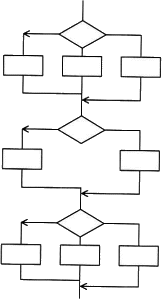
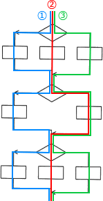

# [令和3年春期 午前 問48](https://www.ap-siken.com/kakomon/03_haru/q48.html)

#問題 #テクノロジ #システム開発技術 #実装・構築

解説を表示解説を隠す

<strong>問48</strong>　あるプログラムについて，流れ図で示される部分に関するテストを，命令網羅で実施する場合，最小のテストケース数は幾つか。ここで，各判定条件は流れ図に示された部分の先行する命令の結果から影響を受けないものとする。 

<ul class="ap-choices">
<li class="ap-choice-item ap-correct">

ア　3

正しい。<a href="用語/命令網羅" class="internal-link" data-href="用語/命令網羅">命令網羅</a>では全命令を少なくとも1回実行する最小ケース数は3です。

</li>
<li class="ap-choice-item ap-wrong">

イ　6

<a href="用語/命令網羅" class="internal-link" data-href="用語/命令網羅">命令網羅</a>の最小ケース数ではありません。

</li>
<li class="ap-choice-item ap-wrong">

ウ　8

<a href="用語/命令網羅" class="internal-link" data-href="用語/命令網羅">命令網羅</a>の最小ケース数ではありません。

</li>
<li class="ap-choice-item ap-wrong">

エ　18

<a href="用語/命令網羅" class="internal-link" data-href="用語/命令網羅">命令網羅</a>の最小ケース数ではありません。

</li>
</ul>

<h4>解説</h4>

<a href="用語/ホワイトボックステスト" class="internal-link" data-href="用語/ホワイトボックステスト">ホワイトボックステスト</a>における網羅性のレベルには以下の5種類があります。<a href="用語/命令網羅" class="internal-link" data-href="用語/命令網羅">命令網羅</a>：すべての命令を少なくとも1回は実行する。<a href="用語/判定条件網羅" class="internal-link" data-href="用語/判定条件網羅">判定条件網羅</a>：判定条件の真偽を少なくとも1回は実行する。<a href="用語/条件網羅" class="internal-link" data-href="用語/条件網羅">条件網羅</a>：判定条件が複数ある場合に、それぞれの条件が真・偽の場合を組み合わせた<a href="用語/テストケース" class="internal-link" data-href="用語/テストケース">テストケース</a>を設計する。判定条件・<a href="用語/条件網羅" class="internal-link" data-href="用語/条件網羅">条件網羅</a>：<a href="用語/判定条件網羅" class="internal-link" data-href="用語/判定条件網羅">判定条件網羅</a>と<a href="用語/条件網羅" class="internal-link" data-href="用語/条件網羅">条件網羅</a>を組み合わせて<a href="用語/テストケース" class="internal-link" data-href="用語/テストケース">テストケース</a>を設計する。<a href="用語/複数条件網羅" class="internal-link" data-href="用語/複数条件網羅">複数条件網羅</a>：判定条件のすべての可能な結果の組合せを網羅し、かつ、すべての命令を少なくとも1回は実行するように<a href="用語/テストケース" class="internal-link" data-href="用語/テストケース">テストケース</a>を作成する。<a href="用語/命令網羅" class="internal-link" data-href="用語/命令網羅">命令網羅</a>は、すべてのプログラム中の全ての命令を少なくとも1回は実行するように<a href="用語/テストケース" class="internal-link" data-href="用語/テストケース">テストケース</a>を設計することです。問題文の<a href="用語/流れ図" class="internal-link" data-href="用語/流れ図">流れ図</a>のテストを<a href="用語/命令網羅" class="internal-link" data-href="用語/命令網羅">命令網羅</a>で実行すると、<a href="用語/テストケース" class="internal-link" data-href="用語/テストケース">テストケース</a>が最低3つあれば全ての命令を検証することができます。したがって「ア」が適切です。

