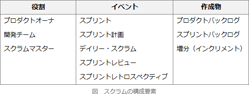

# [令和3年春期 午前 問49](https://www.ap-siken.com/kakomon/03_haru/q49.html)

#問題 #テクノロジ #ソフトウェア開発管理技術 #開発プロセス・手法

解説を表示解説を隠す

<strong>問49</strong>　スクラムチームにおけるプロダクトオーナーの役割はどれか。

<ul class="ap-choices">
<li class="ap-choice-item ap-correct">

ア　ゴールとミッションが達成できるように，プロダクトバックログのアイテムの優先順位を決定する。

正しい。プロダクトオーナーの役割です。

</li>
<li class="ap-choice-item ap-wrong">

イ　チームのコーチやファシリテータとして，スクラムが円滑に進むように支援する。

<a href="用語/スクラム" class="internal-link" data-href="用語/スクラム">スクラム</a>マスターの役割です。

</li>
<li class="ap-choice-item ap-wrong">

ウ　プロダクトを完成させるための具体的な作り方を決定する。

開発チームの役割です。

</li>
<li class="ap-choice-item ap-wrong">

エ　リリース判断可能なプロダクトのインクリメントを完成する。

開発チームの役割です。

</li>
</ul>

<h4>解説</h4>

<a href="用語/スクラム" class="internal-link" data-href="用語/スクラム">スクラム</a>は、<a href="用語/アジャイル" class="internal-link" data-href="用語/アジャイル">アジャイル</a>開発の方法論の1つで、開発プロジェクトを数週間程度の短期間ごとに区切り、その期間内に分析、設計、実装、テストの一連の活動を行い、一部分の機能を完成させるという作業を繰り返しながら、段階的に動作可能なシステムを作り上げる<a href="用語/フレームワーク" class="internal-link" data-href="用語/フレームワーク">フレームワーク</a>です。<a href="用語/スクラム" class="internal-link" data-href="用語/スクラム">スクラム</a>開発では開発反復の単位を「<a href="用語/スプリント" class="internal-link" data-href="用語/スプリント">スプリント</a>」といいます。<a href="用語/スクラム" class="internal-link" data-href="用語/スクラム">スクラム</a>では、<a href="用語/スクラムチーム" class="internal-link" data-href="用語/スクラムチーム">スクラムチーム</a>を構成するプロダクトオーナー・開発チーム・<a href="用語/スクラム" class="internal-link" data-href="用語/スクラム">スクラム</a>マスターの役割、並びに5つのイベントと3つの作成物が定義されています。

各役割（ロール）については次の通りです。プロダクトオーナーは、チームに最も価値の高いソフトウェアを開発してもらうために、プロダクトに必要な機能を定義し、<a href="用語/プロダクトバックログ" class="internal-link" data-href="用語/プロダクトバックログ">プロダクトバックログ</a>の追加・削除・順位付けを行う。開発への投資に対する効果を最大にすることに責任をもつ。開発チームは実際に開発を行うチームのことで、開発者たちを指す。ビジネスアナリスト、プログラマー、テスター、アーキテクト、デザイナーなどの機能横断的な様々な技能を持った人がプロダクトを中心に集まり、自律的に行動する。開発チームはバックログに入っている項目を完了状態にし、プロダクトの価値を高めていくことに責任を持つ。<a href="用語/スクラム" class="internal-link" data-href="用語/スクラム">スクラム</a>マスターは<a href="用語/スクラムチーム" class="internal-link" data-href="用語/スクラムチーム">スクラムチーム</a>全体が自律的に協働できるように、場作りをするファシリテーター的な役割を担う。ときにはコーチとなってメンバーの相談に乗ったり、開発チームが抱えている問題を取り除いたりする。<a href="用語/スクラム" class="internal-link" data-href="用語/スクラム">スクラム</a>全体をうまく回すことに責任を持つ。したがって、プロダクトオーナーの役割を説明したものは「ア」となります。

