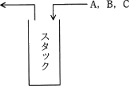
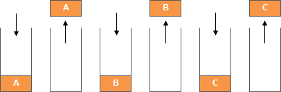
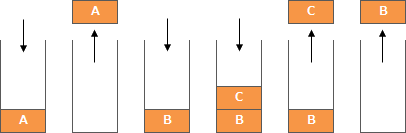
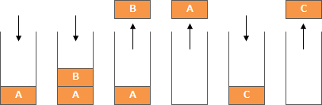
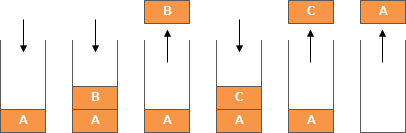
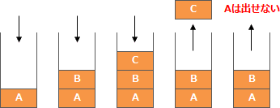
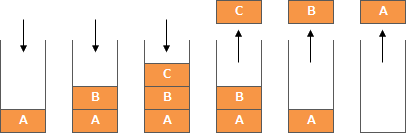

# [令和3年春期 午前 問5](https://www.ap-siken.com/kakomon/03_haru/q5.html)

#問題 #テクノロジ #アルゴリズムとプログラミング #データ構造

解説を表示解説を隠す

<strong>問5</strong>　A，B，Cの順序で入力されるデータがある。各データについてスタックへの挿入と取出しを1回ずつ行うことができる場合，データの出力順序は何通りあるか。 

<ul class="ap-choices">
<li class="ap-choice-item ap-wrong">

ア　3

<a href="用語/スタック" class="internal-link" data-href="用語/スタック">スタック</a>で実現できる順序を3通りと数えた誤り。

</li>
<li class="ap-choice-item ap-wrong">

イ　4

実現可能な順序を1つ見落とした誤り（正解は5通り）。

</li>
<li class="ap-choice-item ap-correct">

ウ　5

正しい。3!＝6通りのうち，C，A，Bは<a href="用語/スタック" class="internal-link" data-href="用語/スタック">スタック</a>の制約で不可能。

</li>
<li class="ap-choice-item ap-wrong">

エ　6

3!＝6通りすべて可能とした誤り。C，A，Bは出力できない。

</li>
</ul>

<h4>解説</h4>

A，B，Cの出力順序としては「3!＝6種類」があります。それぞれが出力可能であるかを検証します。

<strong>A，B，C</strong> … push(A) → pop → push(B) → pop → push(C) → pop の順序で出力可能です。

<strong>A，C，B</strong> … push(A) → pop → push(B) → push(C) → pop → pop の順序で出力可能です。

<strong>B，A，C</strong> … push(A) → push(B) → pop → pop → push(C) → pop の順序で出力可能です。

<strong>B，C，A</strong> … push(A) → push(B) → pop → push(C) → pop → pop の順序で出力可能です。

<strong>C，A，B</strong> … push(A) → push(B) → push(C) → pop → pop ❌ ※Cの出力後，Bより先にAを出力することができないため無理な順序です。

<strong>C，B，A</strong> … push(A) → push(B) → push(C) → pop → pop → pop の順序で出力可能です。

以上より，データの出力順序は5通りになります。したがって「ウ」が正解です。<a href="用語/スタック" class="internal-link" data-href="用語/スタック">スタック</a>の構造上，後からpushされた要素を出力した後，その要素より2つ以上前にpushされた要素を続けて出力することはできません。

