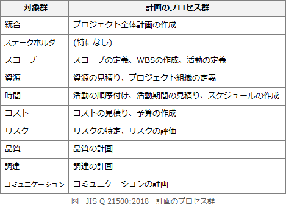

# [令和3年春期 午前 問51](https://www.ap-siken.com/kakomon/03_haru/q51.html)

#問題 #マネジメント #プロジェクトマネジメント #プロジェクトマネジメント

解説を表示解説を隠す

<strong>問51</strong>　JIS Q 21500:2018(プロジェクトマネジメントの手引)によれば，プロジェクトマネジメントのプロセスのうち，計画のプロセス群に属するプロセスはどれか。

<ul class="ap-choices">
<li class="ap-choice-item ap-correct">

ア　スコープの定義

正しい。<a href="用語/スコープの定義" class="internal-link" data-href="用語/スコープの定義">スコープの定義</a>は、プロジェクトの最終状態を定義してプロジェクト・スコープの明確さを達成することを目的とするプロセスで、<a href="用語/計画のプロセス群" class="internal-link" data-href="用語/計画のプロセス群">計画のプロセス群</a>に属します。

</li>
<li class="ap-choice-item ap-wrong">

イ　品質保証の遂行

<a href="用語/品質保証の遂行" class="internal-link" data-href="用語/品質保証の遂行">品質保証の遂行</a>は、確定した目標・品質要求事項及び規格を満たしそうかを明らかにするプロセスで、<a href="用語/実行のプロセス群" class="internal-link" data-href="用語/実行のプロセス群">実行のプロセス群</a>に属します。

</li>
<li class="ap-choice-item ap-wrong">

ウ　プロジェクト憲章の作成

<a href="用語/プロジェクト憲章の作成" class="internal-link" data-href="用語/プロジェクト憲章の作成">プロジェクト憲章の作成</a>は、プロジェクトを正式に許可する文書である<a href="用語/プロジェクト憲章" class="internal-link" data-href="用語/プロジェクト憲章">プロジェクト憲章</a>を作成することを目的とするプロセスで、立上げのプロセス群に属します。

</li>
<li class="ap-choice-item ap-wrong">

エ　プロジェクトチームの編成

<a href="用語/プロジェクトチームの編成" class="internal-link" data-href="用語/プロジェクトチームの編成">プロジェクトチームの編成</a>は、プロジェクトの完遂に必要な人的資源を得ることを目的とするプロセスで、立上げのプロセス群に属します。

</li>
</ul>

<h4>解説</h4>

<a href="用語/JIS Q 21500" class="internal-link" data-href="用語/JIS Q 21500">JIS Q 21500</a>は、<a href="用語/PMBOK" class="internal-link" data-href="用語/PMBOK">PMBOK</a>をベースにしたISO規格"ISO 21500"のJIS規格です。<a href="用語/プロジェクトマネジメント" class="internal-link" data-href="用語/プロジェクトマネジメント">プロジェクトマネジメント</a>に関するいくつかの用語を定義するとともに、<a href="用語/プロジェクトマネジメント" class="internal-link" data-href="用語/プロジェクトマネジメント">プロジェクトマネジメント</a>の全体像、<a href="用語/PMBOK" class="internal-link" data-href="用語/PMBOK">PMBOK</a>第6版まででお馴染みの5つのプロセス群（立上げ、計画、実行、管理、終結)、10つの対象群で行うべき作業の大枠を規定しています。<a href="用語/計画のプロセス群" class="internal-link" data-href="用語/計画のプロセス群">計画のプロセス群</a>は、スコープ、スケジュール、コスト等の各対象群ごとに計画の詳細を作成するプロセスの集まりで、いわゆる"○○マネジメント計画の作成"で実施すべき作業が含まれます。<a href="用語/JIS Q 21500" class="internal-link" data-href="用語/JIS Q 21500">JIS Q 21500</a>によれば、<a href="用語/計画のプロセス群" class="internal-link" data-href="用語/計画のプロセス群">計画のプロセス群</a>では対象群ごとに計画の詳細を作成する作業を実施することとされています。

選択肢のうち<a href="用語/計画のプロセス群" class="internal-link" data-href="用語/計画のプロセス群">計画のプロセス群</a>に属するプロセスは、「ア」の"<a href="用語/スコープの定義" class="internal-link" data-href="用語/スコープの定義">スコープの定義</a>"が適切です。"<a href="用語/スコープの定義" class="internal-link" data-href="用語/スコープの定義">スコープの定義</a>"は、プロジェクトの最終状態を定義することによって、目標、成果物、要求事項及び境界を含むプロジェクト・スコープの明確さを達成することを目的とするプロセスで、<a href="用語/計画のプロセス群" class="internal-link" data-href="用語/計画のプロセス群">計画のプロセス群</a>に属しています。"<a href="用語/品質保証の遂行" class="internal-link" data-href="用語/品質保証の遂行">品質保証の遂行</a>"は<a href="用語/実行のプロセス群" class="internal-link" data-href="用語/実行のプロセス群">実行のプロセス群</a>、"<a href="用語/プロジェクト憲章の作成" class="internal-link" data-href="用語/プロジェクト憲章の作成">プロジェクト憲章の作成</a>"と"<a href="用語/プロジェクトチームの編成" class="internal-link" data-href="用語/プロジェクトチームの編成">プロジェクトチームの編成</a>"は立上げのプロセス群に属します。

