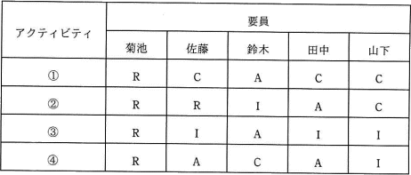

# [令和3年春期 午前 問52](https://www.ap-siken.com/kakomon/03_haru/q52.html)

#問題 #マネジメント #プロジェクトマネジメント #プロジェクトの資源

解説を表示解説を隠す

<strong>問52</strong>　表は，RACIチャートを用いた，ある組織の責任分担マトリックスである。条件を満たすように責任分担を見直すとき，適切なものはどれか。〔条件〕 ・各アクティビティにおいて，実行責任者は1人以上とする。 ・各アクティビティにおいて，説明責任者は1人とする。 

<ul class="ap-choices">
<li class="ap-choice-item ap-wrong">

ア　アクティビティ①の菊池の責任をIに変更

<a href="用語/アクティビティ" class="internal-link" data-href="用語/アクティビティ">アクティビティ</a>①は条件を満たしており，説明責任者が1人でない問題の修正にはなりません。

</li>
<li class="ap-choice-item ap-wrong">

イ　アクティビティ②の佐藤の責任をAに変更

<a href="用語/アクティビティ" class="internal-link" data-href="用語/アクティビティ">アクティビティ</a>②は条件を満たしており，説明責任者が2人になる<a href="用語/アクティビティ" class="internal-link" data-href="用語/アクティビティ">アクティビティ</a>④の修正にはなりません。

</li>
<li class="ap-choice-item ap-wrong">

ウ　アクティビティ③の鈴木の責任をCに変更

<a href="用語/アクティビティ" class="internal-link" data-href="用語/アクティビティ">アクティビティ</a>③は条件を満たしており，説明責任者が2人になる<a href="用語/アクティビティ" class="internal-link" data-href="用語/アクティビティ">アクティビティ</a>④の修正にはなりません。

</li>
<li class="ap-choice-item ap-correct">

エ　アクティビティ④の田中の責任をRに変更

正しい。<a href="用語/アクティビティ" class="internal-link" data-href="用語/アクティビティ">アクティビティ</a>④で説明責任者（A）が2人になっているため，田中をRに変更すると説明責任者が1人になり条件を満たします。

</li>
</ul>

<h4>解説</h4>

RACIチャートは、責任分担表(<a href="用語/RAM" class="internal-link" data-href="用語/RAM">RAM</a>)の一種で、2次元の表の各軸に<a href="用語/要員" class="internal-link" data-href="用語/要員">要員</a>名と作業を設定し、それぞれの<a href="用語/要員" class="internal-link" data-href="用語/要員">要員</a>が担う役割および負う責任を作業別に一覧にしたものです。<a href="用語/プロジェクト" class="internal-link" data-href="用語/プロジェクト">プロジェクト</a>内での責任を明確化するとともに作業が適切に割り振られる手助けをします。各アルファベットは次の意味をもちます。

R（Responsible）…実行責任 A（Accountable）…説明責任 C（Consulted）…相談対応 I（Informed）…報告先、情報提供

設問の条件をアルファベットに対応させると、<a href="用語/アクティビティ" class="internal-link" data-href="用語/アクティビティ">アクティビティ</a>ごとに"R(実行責任者)"を1人以上、"A(説明責任者)"を1人にしなければなりません。RACIチャートを見ると、"A"が2人になっている<a href="用語/アクティビティ" class="internal-link" data-href="用語/アクティビティ">アクティビティ</a>④だけがこの条件を満たしません。よって、<a href="用語/アクティビティ" class="internal-link" data-href="用語/アクティビティ">アクティビティ</a>④で"A"である、佐藤さんまたは田中さんを"A"以外に変更することになります。したがって、田中さんの責任を"R"に変更する「エ」の方法が適切です。

