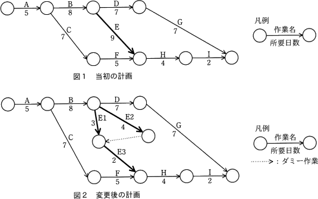
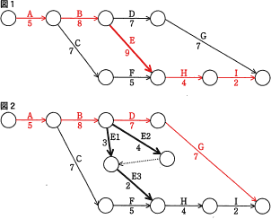

# [令和3年春期 午前 問53](https://www.ap-siken.com/kakomon/03_haru/q53.html)

#問題 #マネジメント #プロジェクトマネジメント #プロジェクトの時間

解説を表示解説を隠す

<strong>問53</strong>　プロジェクトのスケジュールを短縮したい。当初の計画は図1のとおりである。作業Eを作業E1，E2，E3に分けて，図2のように計画を変更すると，スケジュールは全体で何日短縮できるか。 

<ul class="ap-choices">
<li class="ap-choice-item ap-correct">

ア　1

正しい。図1の最短完了日数28日から図2の27日へ1日短縮。

</li>
<li class="ap-choice-item ap-wrong">

イ　2

作業Eの短縮分だけを全体短縮と見積もった誤答です。

</li>
<li class="ap-choice-item ap-wrong">

ウ　3

作業Eの短縮分（9日→6日）をそのまま全体短縮と見積もった誤答です。

</li>
<li class="ap-choice-item ap-wrong">

エ　4

<a href="用語/クリティカルパス" class="internal-link" data-href="用語/クリティカルパス">クリティカルパス</a>の移動を考慮せず、作業の並行化による短縮を過大評価した誤答です。

</li>
</ul>

<h4>解説</h4>

この設問の変更例のように、開始当初の計画では直列に並んでいた作業を同時並行的に行い期間短縮を図る方法を<a href="用語/ファストトラッキング" class="internal-link" data-href="用語/ファストトラッキング">ファストトラッキング</a>といいます。ただし、本来は順番通りになされるべきであった作業を並行して行うことになるので、順序や前後関係がより複雑になるなどの弊害もあります。単純な<a href="用語/アローダイアグラム" class="internal-link" data-href="用語/アローダイアグラム">アローダイアグラム</a>なので、それぞれのパスの日数計算は省きます。図1では「A→B→E→H→I」が<a href="用語/クリティカルパス" class="internal-link" data-href="用語/クリティカルパス">クリティカルパス</a>となり、全体の最短完了日数は以下のようにパス上の作業日数の合計です。 5＋8＋9＋4＋2＝28(日)

図2では、図1で<a href="用語/クリティカルパス" class="internal-link" data-href="用語/クリティカルパス">クリティカルパス</a>にあった作業E(9日)が<a href="用語/ファストトラッキング" class="internal-link" data-href="用語/ファストトラッキング">ファストトラッキング</a>技法によって分割され、E2(4日)→E3(2日)の6日に短縮されています。このまま最短完了日数が3日短縮といいたいところですが、作業Eが短縮されたことによって<a href="用語/クリティカルパス" class="internal-link" data-href="用語/クリティカルパス">クリティカルパス</a>が「A→B→D→G」に移り、最短完了日数も以下のように変わります。 5＋8＋7＋7＝27(日)

したがって、図2のように<a href="用語/ファストトラッキング" class="internal-link" data-href="用語/ファストトラッキング">ファストトラッキング</a>を適用した場合、全体のスケジュールは、図1の当初計画より1日だけ短縮されます。

