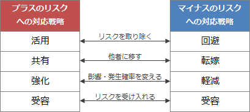

# [令和3年春期 午前 問54](https://www.ap-siken.com/kakomon/03_haru/q54.html)

#問題 #マネジメント #プロジェクトマネジメント #プロジェクトのリスク

解説を表示解説を隠す

<strong>問54</strong>　PMBOKガイド第6版によれば，リスクにはマイナスの影響を及ぼすリスク(脅威)とプラスの影響を及ぼすリスク(好機)がある。プラスの影響を及ぼすリスクに対する"強化"の戦略はどれか。

<ul class="ap-choices">
<li class="ap-choice-item ap-wrong">

ア　いかなる積極的行動も取らないが，好機が実現したときにそのベネフィットを享受する。

これは"受容"の説明です。

</li>
<li class="ap-choice-item ap-wrong">

イ　好機が確実に起こり，発生確率が100%にまで高まると保証することによって，特別の好機に関連するベネフィットを捉えようとする。

これは"活用"の説明です。

</li>
<li class="ap-choice-item ap-wrong">

ウ　好機のオーナーシップを第三者に移転して，好機が発生した場合にそれがベネフィットの一部を共有できるようにする。

これは"共有"の説明です。

</li>
<li class="ap-choice-item ap-correct">

エ　好機の発生確率や影響度，又はその両者を増大させる。

正しい。"強化"に該当します。

</li>
</ul>

<h4>解説</h4>

<a href="用語/PMBOK" class="internal-link" data-href="用語/PMBOK">PMBOK</a>ガイド第6版によれば、<a href="用語/プロジェクト" class="internal-link" data-href="用語/プロジェクト">プロジェクト</a>にプラスの影響を与える<a href="用語/リスク" class="internal-link" data-href="用語/リスク">リスク</a>(好機)への対応戦略には「活用」「共有」「強化」「受容」の4種類があります。<a href="用語/PMBOK" class="internal-link" data-href="用語/PMBOK">PMBOK</a>の定義は長いので要点だけを記載します。

活用：好機が確実に到来するように、現実化の不確実性を取り除くための戦略 共有：好機を得られる能力の高い第三者に<a href="用語/プロジェクト" class="internal-link" data-href="用語/プロジェクト">プロジェクト</a>の実行権限の一部、または全部を与える戦略 強化：好機のプラスの影響を増加させたり、その発生確率を高めたりする戦略 受容：積極的な利用はしないが、好機が現実化したときにはその利益を享受しようとする戦略

"強化"はプラスの<a href="用語/リスク" class="internal-link" data-href="用語/リスク">リスク</a>が現実化する確率を高めたり、現実化したときのプラスの影響を増加させる戦略です。ざっくり言うと、マイナスの<a href="用語/リスクへの対応" class="internal-link" data-href="用語/リスクへの対応">リスクへの対応</a>策である"軽減"の反対の行動です。選択肢の中では「エ」が"強化"に該当します。

