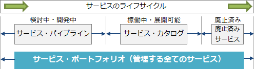

# [令和3年春期 午前 問56](https://www.ap-siken.com/kakomon/03_haru/q56.html)

#問題 #マネジメント #サービスマネジメント

解説を表示解説を隠す

<strong>問56</strong>　ITIL 2011 editionによれば，サービス・ポートフォリオの説明のうち，適切なものはどれか。

<ul class="ap-choices">
<li class="ap-choice-item ap-correct">

ア　サービス・プロバイダの約束事項と投資を表すものであって，サービス・プロバイダによって管理されている"検討中か開発中"，"稼働中か展開可能"及び"廃止済み"の全てのサービスが含まれる。

正しい。詳細：<a href="用語/サービスポートフォリオ" class="internal-link" data-href="用語/サービスポートフォリオ">サービスポートフォリオ</a>

</li>
<li class="ap-choice-item ap-wrong">

イ　サービスの販売と提供の支援に使用され，顧客に公開されるものであって，"検討中か開発中"と"廃止済み"のサービスは含まれず，"稼働中か展開可能"のサービスだけが含まれる。

これは<a href="用語/サービスカタログ" class="internal-link" data-href="用語/サービスカタログ">サービスカタログ</a>の説明です。

</li>
<li class="ap-choice-item ap-wrong">

ウ　投資の機会と実現される価値を含むものであって，"廃止済み"のサービスは含まれず，"検討中か開発中"のサービスと"稼働中か展開可能"のサービスが含まれる。

"廃止済み"のサービスもサービス・ポートフォリオに含まれるため不適切です。

</li>
<li class="ap-choice-item ap-wrong">

エ　どのようなサービスが提供できたのか，実力を示すものであって，"検討中か開発中"のサービスは含まれず，"稼働中か展開可能"のサービスと"廃止済み"のサービスが含まれる。

"検討中か開発中"のサービスもサービス・ポートフォリオに含まれるため不適切です。

</li>
</ul>

<h4>解説</h4>

<a href="用語/ITIL" class="internal-link" data-href="用語/ITIL">ITIL</a> 2011 editionにおける<a href="用語/サービスポートフォリオ" class="internal-link" data-href="用語/サービスポートフォリオ">サービスポートフォリオ</a>とは、サービス・プロバイダによって管理されている全てのサービスをリスト化し、そのサービスごとに詳細情報をまとめたものです。<a href="用語/サービスポートフォリオ" class="internal-link" data-href="用語/サービスポートフォリオ">サービスポートフォリオ</a>内のサービスは、<a href="用語/サービスライフサイクル" class="internal-link" data-href="用語/サービスライフサイクル">サービスライフサイクル</a>上の位置に応じ、"検討中か開発中"サービスのリストである「<a href="用語/サービス・パイプライン" class="internal-link" data-href="用語/サービス・パイプライン">サービス・パイプライン</a>」、"稼働中か展開可能"サービスのリストである「<a href="用語/サービスカタログ" class="internal-link" data-href="用語/サービスカタログ">サービスカタログ</a>」、"廃止済み"サービスのリストである「廃止済みサービス」に分けて管理されています。

したがって「ア」の説明が適切です。

