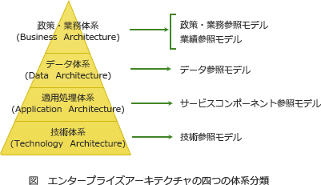

# [令和3年春期 午前 問61](https://www.ap-siken.com/kakomon/03_haru/q61.html)

#問題 #ストラテジ #システム戦略 #情報システム戦略

解説を表示解説を隠す

<strong>問61</strong>　エンタープライズアーキテクチャの"四つの分類体系"に含まれるアーキテクチャは，ビジネスアーキテクチャ，テクノロジアーキテクチャ，アプリケーションアーキテクチャともう一つはどれか。

<ul class="ap-choices">
<li class="ap-choice-item ap-wrong">

ア　システムアーキテクチャ

EAの四つの分類体系の名称ではありません。本問で問われているのはビジネス・データ・アプリケーション・テクノロジの四階層です。

</li>
<li class="ap-choice-item ap-wrong">

イ　ソフトウェアアーキテクチャ

EAの四つの分類体系の名称ではありません。処理体系・技術体系はアプリケーションアーキテクチャとテクノロジアーキテクチャで扱います。

</li>
<li class="ap-choice-item ap-correct">

ウ　データアーキテクチャ

正しい。データアーキテクチャ（データ体系）は、各業務・システムで利用される情報（データ）の内容と関連性を体系的に示す階層です。

</li>
<li class="ap-choice-item ap-wrong">

エ　バスアーキテクチャ

EAの四つの分類体系の名称ではありません。コンピュータ構成の<a href="用語/バス" class="internal-link" data-href="用語/バス">バス</a>とは別の用語です。

</li>
</ul>

<h4>解説</h4>

エンタープライズアーキテクチャ（Enterprise Architecture、以下EAと言う）は、社会環境や情報技術の変化に素早く対応できるよう、「全体最適」の観点から業務とシステム全体を改革するための<a href="用語/フレームワーク" class="internal-link" data-href="用語/フレームワーク">フレームワーク</a>です。主に大企業や政府、地方公共団体といった巨大な組織（enterprise）の業務手順と情報システムの標準化、組織の最適化を図るための方法論として活用されます。

EAでは、統一的な手法で<a href="用語/モデル化" class="internal-link" data-href="用語/モデル化">モデル化</a>するために、業務からシステムに至るまでの関係を以下の4つの階層に区分しています。

<strong>ビジネス・アーキテクチャ（政策・業務体系）</strong>　政策・業務の内容、実施主体、<a href="用語/業務フロー" class="internal-link" data-href="用語/業務フロー">業務フロー</a>等について、共通化・合理化など実現すべき姿を体系的に示したもの。構成要素：<a href="用語/業務説明書" class="internal-link" data-href="用語/業務説明書">業務説明書</a>、機能構成図、機能情報関連図、<a href="用語/業務フロー" class="internal-link" data-href="用語/業務フロー">業務フロー</a>など

<strong>データ・アーキテクチャ（データ体系）</strong>　各業務・システムにおいて利用される情報すなわちシステム上のデータの内容、各情報（データ）間の関連性を体系的に示したもの。構成要素：情報体系クラス図、<a href="用語/エンティティ" class="internal-link" data-href="用語/エンティティ">エンティティ</a>・リレーション図、<a href="用語/データ定義表" class="internal-link" data-href="用語/データ定義表">データ定義表</a>など

<strong>アプリケーション・アーキテクチャ（処理体系）</strong>　業務処理に最適な情報システムの形態を体系的に示したもの。構成要素：<a href="用語/情報システム関連図" class="internal-link" data-href="用語/情報システム関連図">情報システム関連図</a>や<a href="用語/情報システム機能構成図" class="internal-link" data-href="用語/情報システム機能構成図">情報システム機能構成図</a>など

<strong>テクノロジ・アーキテクチャ（技術体系）</strong>　実際にシステムを構築する際に利用する諸々の技術的構成要素（ハード・ソフト・ネットワーク等）を体系的に示したもの。構成要素：<a href="用語/ネットワーク構成図" class="internal-link" data-href="用語/ネットワーク構成図">ネットワーク構成図</a>、<a href="用語/ソフトウェア構成図" class="internal-link" data-href="用語/ソフトウェア構成図">ソフトウェア構成図</a>、<a href="用語/ハードウェア構成図" class="internal-link" data-href="用語/ハードウェア構成図">ハードウェア構成図</a>など

したがって残る一つは「データアーキテクチャ」ということになります。

