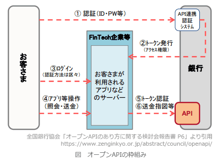

# [令和3年春期 午前 問62](https://www.ap-siken.com/kakomon/03_haru/q62.html)

#問題 #ストラテジ #システム戦略 #情報システム戦略

解説を表示解説を隠す

<strong>問62</strong>　業務システムの構築に際し，オープンAPIを活用する構築手法の説明はどれか。

<ul class="ap-choices">
<li class="ap-choice-item ap-wrong">

ア　構築するシステムの概要や予算をインターネットなどにオープンに告知し，アウトソース先の業者を公募する。

これは公募型プロポーザルの説明です。

</li>
<li class="ap-choice-item ap-wrong">

イ　構築テーマをインターネットなどでオープンに告知し，不特定多数から資金調達を行い開発費の不足を補う。

これは<a href="用語/クラウドファンディング" class="internal-link" data-href="用語/クラウドファンディング">クラウドファンディング</a>の説明です。

</li>
<li class="ap-choice-item ap-correct">

ウ　接続仕様や仕組みが外部企業などに公開されている他社のアプリケーションソフトウェアを呼び出して，適宜利用し，データ連携を行う。

正しい。<a href="用語/オープンAPI" class="internal-link" data-href="用語/オープンAPI">オープンAPI</a>の説明です。

</li>
<li class="ap-choice-item ap-wrong">

エ　標準的な構成のハードウェアに仮想化を適用し，必要とするCPU処理能力，ストレージ容量，ネットワーク機能などをソフトウェアで構成し，運用管理を行う。

これはオープンスタック（<a href="用語/OpenStack" class="internal-link" data-href="用語/OpenStack">OpenStack</a>）の説明です。

</li>
</ul>

<h4>解説</h4>

<a href="用語/オープンAPI" class="internal-link" data-href="用語/オープンAPI">オープンAPI</a>は、ソフトウェアやアプリケーションが持つ機能やデータを呼び出すための接続仕様・仕組み（<a href="用語/API" class="internal-link" data-href="用語/API">API</a>）を、外部の事業者に開放することです。<a href="用語/フィンテック" class="internal-link" data-href="用語/フィンテック">フィンテック</a>や<a href="用語/オープンイノベーション" class="internal-link" data-href="用語/オープンイノベーション">オープンイノベーション</a>を加速させる手段として期待されています。特に金融機関においては、2017年5月の改正銀行法の成立により、金融機関が外部事業者との安全なデータ連携を行うための<a href="用語/オープンAPI" class="internal-link" data-href="用語/オープンAPI">オープンAPI</a>が、法律上の努力義務になるなど重要度が増しています。金融機関以外の事業者が、ユーザーのデータを扱えるようになることで、金融機関とは関係のないアプリから残高の確認や振込が行えたり、簡単に家計簿をつけたりなど、より便利で高度な金融サービスの展開が期待されています。

「ウ」が<a href="用語/オープンAPI" class="internal-link" data-href="用語/オープンAPI">オープンAPI</a>の説明として正解です。「ア」は公募型プロポーザル、「イ」は<a href="用語/クラウドファンディング" class="internal-link" data-href="用語/クラウドファンディング">クラウドファンディング</a>、「エ」はオープンスタック（<a href="用語/OpenStack" class="internal-link" data-href="用語/OpenStack">OpenStack</a>）の説明です。

