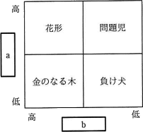
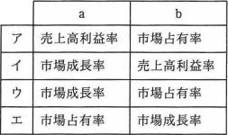

# [令和3年春期 午前 問67](https://www.ap-siken.com/kakomon/03_haru/q67.html)

#問題 #ストラテジ #経営戦略マネジメント #経営戦略手法

解説を表示解説を隠す

<strong>問67</strong>　プロダクトポートフォリオマネジメント(PPM)マトリックスのa，bに入れる語句の適切な組合せはどれか。  

<ul class="ap-choices">
<li class="ap-choice-item ap-wrong">

ア

a・bの軸の割当が、設問図の「<a href="用語/金のなる木" class="internal-link" data-href="用語/金のなる木">金のなる木</a>」「<a href="用語/問題児" class="internal-link" data-href="用語/問題児">問題児</a>」の位置と一致しません。

</li>
<li class="ap-choice-item ap-wrong">

イ

a・bの軸の割当が、設問図の「<a href="用語/金のなる木" class="internal-link" data-href="用語/金のなる木">金のなる木</a>」「<a href="用語/問題児" class="internal-link" data-href="用語/問題児">問題児</a>」の位置と一致しません。

</li>
<li class="ap-choice-item ap-correct">

ウ

正しい。aが<a href="用語/市場成長率" class="internal-link" data-href="用語/市場成長率">市場成長率</a>、bが市場占有率とすると、各象限の位置付けと一致します。

</li>
<li class="ap-choice-item ap-wrong">

エ

a・bの軸の割当が、設問図の「<a href="用語/金のなる木" class="internal-link" data-href="用語/金のなる木">金のなる木</a>」「<a href="用語/問題児" class="internal-link" data-href="用語/問題児">問題児</a>」の位置と一致しません。

</li>
</ul>

<h4>解説</h4>

プロダクトポートフォリオマネジメント(PPM)は、縦軸と横軸に「<a href="用語/市場成長率" class="internal-link" data-href="用語/市場成長率">市場成長率</a>」と「市場占有率」を設定したマトリクス図を4つの象限に区分し，市場における製品の位置付けを分析することで、経営資源の最適な配分を検討する手法です。4つの象限は、市場内の位置付けから以下のような名称で呼ばれています。

花形(star) … [成長率：高、占有率：高]占有率・成長率ともに高く、資金の流入も大きいが、成長に伴い占有率の維持には多額の資金の投入を必要とする分野

<a href="用語/金のなる木" class="internal-link" data-href="用語/金のなる木">金のなる木</a>(cash cow) … [成長率：低、占有率：高]市場の成長がないため追加の投資が必須ではなく、市場占有率の高さから安定した資金・利益の流入が見込める分野

<a href="用語/問題児" class="internal-link" data-href="用語/問題児">問題児</a>(problem child) … [成長率：高、占有率：低]成長率は高いが占有率は低いので、<a href="用語/花形製品" class="internal-link" data-href="用語/花形製品">花形製品</a>とするためには多額の投資が必要になる。投資が失敗し、そのまま成長率が下がれば<a href="用語/負け犬" class="internal-link" data-href="用語/負け犬">負け犬</a>になってしまうため、慎重な対応を必要とする分野

<a href="用語/負け犬" class="internal-link" data-href="用語/負け犬">負け犬</a>(dog) … [成長率：低、占有率：低]成長率・占有率ともに低く、新たな投資による利益の増加も見込めないため市場からの撤退を検討するべき分野

設問の図では"<a href="用語/金のなる木" class="internal-link" data-href="用語/金のなる木">金のなる木</a>"の位置が"a=低，b=高"、および"<a href="用語/問題児" class="internal-link" data-href="用語/問題児">問題児</a>"の位置が"a=高，b=低"となっていることから、aが<a href="用語/市場成長率" class="internal-link" data-href="用語/市場成長率">市場成長率</a>、bが市場占有率であると判断できます。したがって正しい組合せは「ウ」です。

