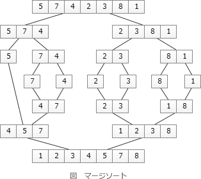

# [令和3年春期 午前 問7](https://www.ap-siken.com/kakomon/03_haru/q7.html)

#問題 #テクノロジ #アルゴリズムとプログラミング #アルゴリズム

解説を表示解説を隠す

<strong>問7</strong>　アルゴリズム設計としての分割統治法に関する記述として，適切なものはどれか。

<ul class="ap-choices">
<li class="ap-choice-item ap-wrong">

ア　与えられた問題を直接解くことが難しいときに，幾つかに分割した一部分に注目し，とりあえず粗い解を出し，それを逐次改良して精度の良い解を得る方法である。

これは局所探索法の説明です。

</li>
<li class="ap-choice-item ap-wrong">

イ　起こり得る全てのデータを組み合わせ，それぞれの解を調べることによって，データの組合せのうち無駄なものを除き，実際に調べる組合せ数を減らす方法である。

これは分枝限定法の説明です。

</li>
<li class="ap-choice-item ap-correct">

ウ　全体を幾つかの小さな問題に分割して，それぞれの小さな問題を独立に処理した結果をつなぎ合わせて，最終的に元の問題を解決する方法である。

正しい。<a href="用語/分割統治法" class="internal-link" data-href="用語/分割統治法">分割統治法</a>の説明です。

</li>
<li class="ap-choice-item ap-wrong">

エ　まずは問題全体のことは考えずに，問題をある尺度に沿って分解し，各時点で最良の解を選択し，これを繰り返すことによって，全体の最適解を得る方法である。

これは貪欲法(グリーディ法)の説明です。

</li>
</ul>

<h4>解説</h4>

<a href="用語/分割統治法" class="internal-link" data-href="用語/分割統治法">分割統治法</a>は、大きな問題を同じ構造をもつ複数の小さな問題に分割し、その小さな問題の解を統合することで最終的に元の大きな問題を解決しようとする考え方です。整列アルゴリズムだと<a href="用語/クイックソート" class="internal-link" data-href="用語/クイックソート">クイックソート</a>や<a href="用語/マージソート" class="internal-link" data-href="用語/マージソート">マージソート</a>が<a href="用語/分割統治法" class="internal-link" data-href="用語/分割統治法">分割統治法</a>の考え方に基づくアルゴリズムです。

アは局所探索法の説明です。現在の解と近傍解を比較し、近傍解が良ければ新しい解として入れ替えることを繰り返します。

イは分枝限定法の説明です。全体問題を場合分けによって部分問題にする（分枝操作）と、解く必要のない部分問題を切り捨てる（限定操作）ことによって効率よく解を求める方法です。

ウは正しい。<a href="用語/分割統治法" class="internal-link" data-href="用語/分割統治法">分割統治法</a>の説明です。

エは貪欲法(グリーディ法)の説明です。

