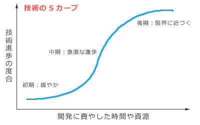

# [令和3年春期 午前 問71](https://www.ap-siken.com/kakomon/03_haru/q71.html)

#問題 #ストラテジ #技術戦略マネジメント #技術開発戦略の立案

解説を表示解説を隠す

<strong>問71</strong>　"技術のSカーブ"の説明として，適切なものはどれか。

<ul class="ap-choices">
<li class="ap-choice-item ap-wrong">

ア　技術の期待感の推移を表すものであり，黎(れい)明期，流行期，反動期，回復期，安定期に分類される。

これは<a href="用語/ハイプサイクル" class="internal-link" data-href="用語/ハイプサイクル">ハイプサイクル</a>（ハイプ曲線）の説明です。技術のSカーブとは異なります。

</li>
<li class="ap-choice-item ap-correct">

イ　技術の進歩の過程を表すものであり，当初は緩やかに進歩するが，やがて急激に進歩し，成熟期を迎えると進歩は停滞気味になる。

正しい。詳細：<a href="用語/技術のSカーブ" class="internal-link" data-href="用語/技術のSカーブ">技術のSカーブ</a>

</li>
<li class="ap-choice-item ap-wrong">

ウ　工業製品において生産量と生産性の関係を表すものであり，生産量の累積数が増加するほど生産性は向上する傾向にある。

これは<a href="用語/経験曲線" class="internal-link" data-href="用語/経験曲線">経験曲線</a>（エクスペリエンスカーブ）の説明です。

</li>
<li class="ap-choice-item ap-wrong">

エ　工業製品の故障発生の傾向を表すものであり，初期故障期間では故障率は高くなるが，その後の偶発故障期間での故障率は低くなり，製品寿命に近づく摩耗故障期間では故障率は高くなる。

これは<a href="用語/バスタブ曲線" class="internal-link" data-href="用語/バスタブ曲線">バスタブ曲線</a>の説明です。

</li>
</ul>

<h4>解説</h4>

<a href="用語/技術のSカーブ" class="internal-link" data-href="用語/技術のSカーブ">技術のSカーブ</a>（技術進歩のSカーブ）とは、1つの技術進歩の過程を表す言葉です。技術開発の初期は比較的緩やかに進歩し、ある時期を境に急激に進歩し、やがて技術の限界に近づくと進歩の伸びが停滞気味になります。縦軸に技術進歩の度合、横軸に投資した費用や期間をとってグラフにすると、曲線がアルファベットの「S」に似た形状になることからこのように呼ばれます。ある技術がこの曲線のどこに位置するかを分析し、今後の技術戦略や資源の配分に活かします。

