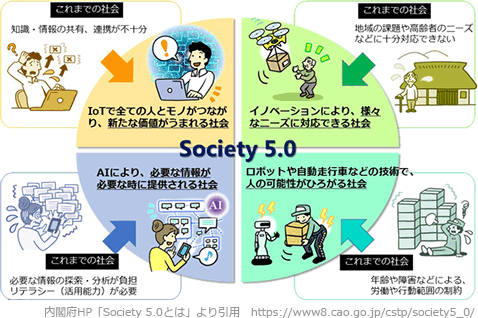

# [令和3年春期 午前 問72](https://www.ap-siken.com/kakomon/03_haru/q72.html)

#問題 #ストラテジ #ビジネスインダストリ #ビジネスシステム

解説を表示解説を隠す

<strong>問72</strong>　政府は，IoTを始めとする様々なICTが最大限に活用され，サイバー空間とフィジカル空間とが融合された"超スマート社会"の実現を推進してきた。必要なものやサービスが人々に過不足なく提供され，年齢や性別などの違いにかかわらず，誰もが快適に生活することができるとされる"超スマート社会"実現への取組は何と呼ばれているか。

<ul class="ap-choices">
<li class="ap-choice-item ap-wrong">

ア　e-Gov

これは<a href="用語/e-Gov" class="internal-link" data-href="用語/e-Gov">e-Gov</a>の説明です。各府省の行政情報の検索・案内やオンライン申請・届出の窓口を担う政府のポータルサイトであり，"超スマート社会"全体の取組名ではありません。

</li>
<li class="ap-choice-item ap-correct">

イ　Society5.0

正しい。サイバー空間とフィジカル空間を高度に融合させた<a href="用語/超スマート社会" class="internal-link" data-href="用語/超スマート社会">超スマート社会</a>の実現を目指す，政府が提唱する未来社会の構想です。詳細：<a href="用語/Society5.0" class="internal-link" data-href="用語/Society5.0">Society5.0</a>

</li>
<li class="ap-choice-item ap-wrong">

ウ　Web2.0

2000年代中頃以降のWeb利用形態の変容を表す言葉です。SNSやブログなど誰もが情報を発信できるフェーズへの移行を指し，本問の"超スマート社会"の取組名ではありません。

</li>
<li class="ap-choice-item ap-wrong">

エ　ダイバーシティ社会

性別・国籍・年齢・障害の有無などの違いを超え多様性を認め合う社会を指します。本問のサイバー空間とフィジカル空間の融合による超スマート社会の取組名ではありません。

</li>
</ul>

<h4>解説</h4>

<a href="用語/Society5.0" class="internal-link" data-href="用語/Society5.0">Society5.0</a>は、狩猟社会、農耕社会、工業社会、情報社会に続く、5番目の新たな社会を指し、日本が目指すべき未来社会の姿として政府で提唱されています。Society5.0は、サイバー空間（仮想空間）とフィジカル空間（現実空間）を高度に融合させたシステム（<a href="用語/サイバーフィジカルシステム" class="internal-link" data-href="用語/サイバーフィジカルシステム">サイバーフィジカルシステム</a>：CPS）により、経済発展と社会的課題の解決を両立する、人間中心の社会です。

<a href="用語/IoT" class="internal-link" data-href="用語/IoT">IoT</a>(Internet of Things)で全ての人とモノがつながり、様々な知識や情報が共有され、今までにない新たな価値を生み出すことで、様々な課題や困難を克服します。社会の変革(<a href="用語/イノベーション" class="internal-link" data-href="用語/イノベーション">イノベーション</a>)を通じて、これまでの閉塞感を打破し、希望の持てる社会、世代を超えて互いに尊重し合あえる社会、一人一人が快適で活躍できる社会を目指しています。

<a href="用語/e-Gov" class="internal-link" data-href="用語/e-Gov">e-Gov</a>は、各府省がインターネットを通じて提供する行政情報の総合的な検索・案内サービスの提供、各府省に対するオンライン申請・届出等の手続の窓口サービスの提供を行う政府のポータルサイトです。Web2.0は、2000年代中頃以降に起こったWebの利用形態の変容を表す言葉で、巨大掲示板、SNS、ブログなどの登場によりインターネットは誰もが自由に情報を発信できる新たなフェーズに移行しました。ダイバーシティ社会は、性別、国籍、年齢、障害の有無、性的指向等の属性の違いを超え、多様な立場や価値観を認め合って、各々が生き生きと働き、活躍し、生活する社会です。したがって正解は「イ」のSociety5.0です。

