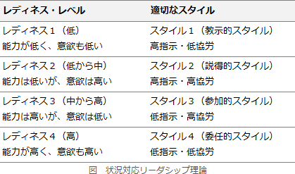

# [令和3年春期 午前 問75](https://www.ap-siken.com/kakomon/03_haru/q75.html)

#問題 #ストラテジ #企業活動 #経営・組織論

解説を表示解説を隠す

<strong>問75</strong>　ハーシィ及びブランチャードが提唱したSL理論の説明はどれか。

<ul class="ap-choices">
<li class="ap-choice-item ap-wrong">

ア　開放の窓，秘密の窓，未知の窓，盲点の窓の四つの窓を用いて，自己理解と対人関係の良否を説明した理論

ジョハリの窓（四つの窓）による自己分析の説明であり、SL理論ではありません。

</li>
<li class="ap-choice-item ap-correct">

イ　教示的，説得的，参加的，委任的の四つに，部下の成熟度レベルによって，リーダーシップスタイルを分類した理論

正しい。詳細：<a href="用語/SL理論" class="internal-link" data-href="用語/SL理論">SL理論</a>

</li>
<li class="ap-choice-item ap-wrong">

ウ　共同化，表出化，連結化，内面化の四つのプロセスによって，個人と組織に新たな知識が創造されるとした理論

これは<a href="用語/SECIモデル" class="internal-link" data-href="用語/SECIモデル">SECIモデル</a>（ナレッジマネジメント）の説明です。

</li>
<li class="ap-choice-item ap-wrong">

エ　生理的，安全，所属と愛情，承認と自尊，自己実現といった五つの段階で欲求が発達するとされる理論

マズローの欲求の5段階説（自己実現理論）の説明であり、SL理論ではありません。

</li>
</ul>

<h4>解説</h4>

<a href="用語/SL理論" class="internal-link" data-href="用語/SL理論">SL理論</a>（状況対応リーダーシップ理論）は、いかなる状況にも効果的な唯一万能のリーダー行動は存在しないという主張の下、リーダーシップの有効性を状況との関係で捉え、状況要素のうち最も重要である部下や集団（フォロワー）の能力及び意欲の水準（レディネス）ごとに、有効性が高いリーダーシップのスタイルを示したモデルです。

