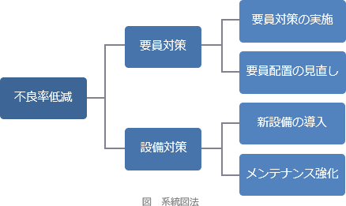

# [令和3年春期 午前 問76](https://www.ap-siken.com/kakomon/03_haru/q76.html)

#問題 #ストラテジ #企業活動 #業務分析・データ利活用

解説を表示解説を隠す

<strong>問76</strong>　系統図法の活用例はどれか。

<ul class="ap-choices">
<li class="ap-choice-item ap-wrong">

ア　解決すべき問題を端か中央に置き，関係する要因を因果関係に従って矢印でつないで周辺に並べ，問題発生に大きく影響している重要な原因を探る。

これは<a href="用語/連関図法" class="internal-link" data-href="用語/連関図法">連関図法</a>の活用事例です。

</li>
<li class="ap-choice-item ap-wrong">

イ　結果とそれに影響を及ぼすと思われる要因との関連を整理し，体系化して，魚の骨のような形にまとめる。

これは<a href="用語/特性要因図" class="internal-link" data-href="用語/特性要因図">特性要因図</a>（フィッシュボーンチャート）の活用事例です。

</li>
<li class="ap-choice-item ap-wrong">

ウ　事実，意見，発想を小さなカードに書き込み，カード相互の親和性によってグループ化して，解決すべき問題を明確にする。

これは<a href="用語/親和図法" class="internal-link" data-href="用語/親和図法">親和図法</a>（KJ法）の活用事例です。

</li>
<li class="ap-choice-item ap-correct">

エ　目的を達成するための手段を導き出し，更にその手段を実施するための幾つかの手段を考えることを繰り返し，細分化していく。

正しい。詳細：<a href="用語/系統図法" class="internal-link" data-href="用語/系統図法">系統図法</a>

</li>
</ul>

<h4>解説</h4>

<a href="用語/系統図法" class="internal-link" data-href="用語/系統図法">系統図法</a>は、目的を達成する手段を見つけるときに、「目的－手段」の連鎖を段階的に下位に掘り下げていくことにより最適な手段を見いだす図法です。

