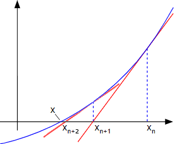

# [令和3年秋期 午前 問1](https://www.ap-siken.com/kakomon/03_aki/q1.html)

#問題 #テクノロジ #基礎理論 #応用数学

解説を表示解説を隠す

<strong>問1</strong>　非線形方程式 ƒ(x)＝0 の近似解法であり，次の手順によって解を求めるものはどれか。ここで，y＝ƒ(x) には接線が存在するものとし，(3)でx0と新たなx0の差の絶対値がある値以下になった時点で繰返しを終了する。〔手順〕(1) 解の近くの適当なx軸の値を定め，x0とする。(2) 曲線 y＝ƒ(x) の，点(x0，ƒ(x0))における接線を求める。(3) 求めた接線と，x軸の交点を新たなx0とし，手順(2)に戻る。

<ul class="ap-choices">
<li class="ap-choice-item ap-wrong">

ア　オイラー法

常<a href="用語/微分" class="internal-link" data-href="用語/微分">微分</a>方程式の数値解法。接線と刻み幅hで<a href="用語/順次" class="internal-link" data-href="用語/順次">順次</a> y(x) を求めるもので、本問の「接線とx軸の交点を繰返す」手順とは異なる。

</li>
<li class="ap-choice-item ap-wrong">

イ　ガウスの消去法

連立一次方程式などを<a href="用語/行列" class="internal-link" data-href="用語/行列">行列</a>表現で解く方法であり、非線形方程式の反復近似とは無関係。

</li>
<li class="ap-choice-item ap-wrong">

ウ　シンプソン法

<a href="用語/数値積分" class="internal-link" data-href="用語/数値積分">数値積分</a>法の一つ。区間を二次関数で近似して<a href="用語/積分" class="internal-link" data-href="用語/積分">積分</a>値を求めるもので、ƒ(x)＝0 の根探索手順ではない。

</li>
<li class="ap-choice-item ap-correct">

エ　ニュートン法

正しい。接線とx軸の交点を<a href="用語/繰返し" class="internal-link" data-href="用語/繰返し">繰返し</a>求め、ƒ(x)＝0 となるxに近づける<a href="用語/近似解法" class="internal-link" data-href="用語/近似解法">近似解法</a>。

</li>
</ul>

<h4>解説</h4>

正しい。<a href="用語/ニュートン法" class="internal-link" data-href="用語/ニュートン法">ニュートン法</a>は、<a href="用語/微分" class="internal-link" data-href="用語/微分">微分</a>方程式の解の一つを求める方法で、任意に定めた解の予測値から始めて、接線とx軸の交点を求める計算を繰り返しながら、その値を ƒ(x) = 0 となるxに近づけていく方法です。計算前のxと計算後のxの差が設定した<a href="用語/誤差" class="internal-link" data-href="用語/誤差">誤差</a>の範囲になるまで計算を繰り返します。

オイラー法は、常<a href="用語/微分" class="internal-link" data-href="用語/微分">微分</a>方程式の数値的解法の一つで、初期値である点(x0，ƒ(x0))における接線を求め、その接線の傾きと十分に小さい刻み幅hを用いて x1=x0+h、x2=x1+h、…における y(x) の<a href="用語/順次" class="internal-link" data-href="用語/順次">順次</a>求めていくことで近似値を得る方法です。

ガウスの消去法（掃き出し法）は、<a href="用語/行列" class="internal-link" data-href="用語/行列">行列</a>表現を用いて、前進消去と後退<a href="用語/代入" class="internal-link" data-href="用語/代入">代入</a>という2つのステップで連立一次方程式などを解くための方法です。

<a href="用語/数値積分" class="internal-link" data-href="用語/数値積分">数値積分</a>法の一つで、非線型方程式の3点を通る二次関数で各区間を近似することで、2点を使う台形公式よりも高精度の近似値を求める方法です。（<a href="用語/シンプソン法" class="internal-link" data-href="用語/シンプソン法">シンプソン法</a>）

