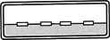
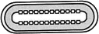
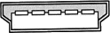
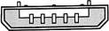
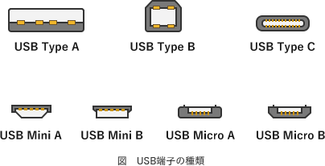

# [令和3年秋期 午前 問10](https://www.ap-siken.com/kakomon/03_aki/q10.html)

#問題 #テクノロジ #コンピュータ構成要素 #入出力デバイス

解説を表示解説を隠す

<strong>問10</strong>　USB Type-Cのプラグ側コネクタの断面図はどれか。ここで，図の縮尺は同一ではない。

<ul class="ap-choices">
<li class="ap-choice-item ap-wrong">

ア　

<a href="用語/USB" class="internal-link" data-href="用語/USB">USB</a> Type-Aのコネクタです。

</li>
<li class="ap-choice-item ap-correct">

イ　

正しい。<a href="用語/USB" class="internal-link" data-href="用語/USB">USB</a> Type-Cのコネクタです。

</li>
<li class="ap-choice-item ap-wrong">

ウ　

<a href="用語/USB" class="internal-link" data-href="用語/USB">USB</a> Mini-Bのコネクタです。

</li>
<li class="ap-choice-item ap-wrong">

エ　

<a href="用語/USB" class="internal-link" data-href="用語/USB">USB</a> Micro-Bのコネクタです。

</li>
</ul>

<h4>解説</h4>

2021年現在、使用されている<a href="用語/USB" class="internal-link" data-href="用語/USB">USB</a>端子の規格には、<a href="用語/USB" class="internal-link" data-href="用語/USB">USB</a>-A、<a href="用語/USB" class="internal-link" data-href="用語/USB">USB</a>-B、<a href="用語/USB" class="internal-link" data-href="用語/USB">USB</a>-Cがあります。さらにAとBにはMiniおよびMicroタイプが存在します。<a href="用語/USB" class="internal-link" data-href="用語/USB">USB</a> Type-Cは、2015年策定のUSB3.1と同時に策定された比較的新しい<a href="用語/USB" class="internal-link" data-href="用語/USB">USB</a>コネクタの規格です。最も大きな特徴は、上下左右が対称なのでどちらの向きでも接続できることです。

つまり、選択肢の図のうち上下左右が対称である「イ」が<a href="用語/USB" class="internal-link" data-href="用語/USB">USB</a> Type-Cです。また各選択のコネクタ形状と規格は次のように対応します。

アは<a href="用語/USB" class="internal-link" data-href="用語/USB">USB</a> Type-Aのコネクタです。イは正しい。<a href="用語/USB" class="internal-link" data-href="用語/USB">USB</a> Type-Cのコネクタです。ウは<a href="用語/USB" class="internal-link" data-href="用語/USB">USB</a> Mini-Bのコネクタです。エは<a href="用語/USB" class="internal-link" data-href="用語/USB">USB</a> Micro-Bのコネクタです。

