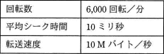
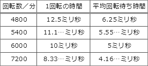

# [令和3年秋期 午前 問11](https://www.ap-siken.com/kakomon/03_aki/q11.html)

#問題 #テクノロジ #コンピュータ構成要素 #入出力装置

解説を表示解説を隠す

<strong>問11</strong>　表に示す仕様の磁気ディスク装置において，1,000バイトのデータの読取りに要する平均時間は何ミリ秒か。ここで，コントローラーの処理時間は平均シーク時間に含まれるものとする。 

<ul class="ap-choices">
<li class="ap-choice-item ap-correct">

ア　15.1

正しい。平均シーク時間10ミリ秒＋平均回転待ち時間5ミリ秒＋<a href="用語/データ転送時間" class="internal-link" data-href="用語/データ転送時間">データ転送時間</a>（0.1ミリ秒）の合計。

</li>
<li class="ap-choice-item ap-wrong">

イ　16.0

<a href="用語/データ転送時間" class="internal-link" data-href="用語/データ転送時間">データ転送時間</a>を1,000バイト÷10Mバイト＝0.1ミリ秒ではなく1ミリ秒と誤って足した場合などの値。

</li>
<li class="ap-choice-item ap-wrong">

ウ　20.1

平均回転待ち時間を1回転分（10ミリ秒）として計算した場合などの値。

</li>
<li class="ap-choice-item ap-wrong">

エ　21.0

平均回転待ち時間を1回転分とし，かつ<a href="用語/データ転送時間" class="internal-link" data-href="用語/データ転送時間">データ転送時間</a>を1ミリ秒と誤算した場合などの値。

</li>
</ul>

<h4>解説</h4>

磁気ディスク装置のデータ読取りに要する時間は「①平均シーク時間＋②平均回転待ち時間＋③<a href="用語/データ転送時間" class="internal-link" data-href="用語/データ転送時間">データ転送時間</a>」で求めます。

①平均シーク時間（<a href="用語/シークタイム" class="internal-link" data-href="用語/シークタイム">シークタイム</a>）…磁気ディスクのヘッドが、目的のデータが保存されている位置まで移動するのにかかる時間の平均

②平均回転待ち時間（<a href="用語/サーチタイム" class="internal-link" data-href="用語/サーチタイム">サーチタイム</a>）…ヘッドの移動が完了した後、読み出す<a href="用語/レコード" class="internal-link" data-href="用語/レコード">レコード</a>の先頭が<a href="用語/磁気ヘッド" class="internal-link" data-href="用語/磁気ヘッド">磁気ヘッド</a>の位置まで磁気ディスクが回転してくるのを待つ時間の平均。目的のデータがどの位置に存在するかはランダムなので、ディスクが1回転するのにかかる時間の半分が平均回転待ち時間となる

③<a href="用語/データ転送時間" class="internal-link" data-href="用語/データ転送時間">データ転送時間</a>…目的のデータを読み出すのに要する時間

この問題では平均シーク時間がわかっているので、平均回転待ち時間と<a href="用語/データ転送時間" class="internal-link" data-href="用語/データ転送時間">データ転送時間</a>がわかればデータの読取り時間が計算できることになります。

平均回転待ち時間は、1回転に要する時間の半分なので、1分÷6,000回転÷2＝60,000ミリ秒÷6,000回転÷2＝5ミリ秒

<a href="用語/転送速度" class="internal-link" data-href="用語/転送速度">転送速度</a>が10Mバイト／秒なので、1,000バイトのデータ転送に要する時間は、1,000バイト÷10Mバイト＝0.1ミリ秒

以上より、データ読取りに要する時間は、10＋5＋0.1＝15.1ミリ秒したがって「ア」が正解となります。

情報処理技術者試験で磁気ディスク装置のアクセス時間が出題される場合、回転数は4800、5400、6000、7200とほぼ決まった値で出題されます。基準となる6,000回転／分の場合の平均回転待ち時間を覚えておけばスムーズに計算することが可能です。

