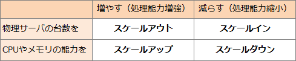

# [令和3年秋期 午前 問12](https://www.ap-siken.com/kakomon/03_aki/q12.html)

#問題 #テクノロジ #システム構成要素 #システムの構成

解説を表示解説を隠す

<strong>問12</strong>　システムが使用する物理サーバの処理能力を，負荷状況に応じて調整する方法としてのスケールインの説明はどれか。

<ul class="ap-choices">
<li class="ap-choice-item ap-wrong">

ア　システムを構成する物理サーバの台数を増やすことによって，システムとしての処理能力を向上する。

これは<a href="用語/スケールアウト" class="internal-link" data-href="用語/スケールアウト">スケールアウト</a>の説明です。

</li>
<li class="ap-choice-item ap-correct">

イ　システムを構成する物理サーバの台数を減らすことによって，システムとしてのリソースを最適化し，無駄なコストを削減する。

正しい。スケールインの説明です。

</li>
<li class="ap-choice-item ap-wrong">

ウ　高い処理能力のCPUへの交換やメモリの追加などによって，システムとしての処理能力を向上する。

これは<a href="用語/スケールアップ" class="internal-link" data-href="用語/スケールアップ">スケールアップ</a>の説明です。

</li>
<li class="ap-choice-item ap-wrong">

エ　低い処理能力のCPUへの交換やメモリの削減などによって，システムとしてのリソースを最適化し，無駄なコストを削減する。

これはスケールダウンの説明です。

</li>
</ul>

<h4>解説</h4>

スケールインとは、システムを構成する物理サーバの台数を減らすことによって、システムとしてのリソースを最適化し、無駄なコストを削減する方法です。負荷が低下したときにサーバ台数を減らして運用コストを抑える考え方です。

アは、サーバ台数を増やして処理能力を向上させる<a href="用語/スケールアウト" class="internal-link" data-href="用語/スケールアウト">スケールアウト</a>の説明です。

イは、上記のとおりスケールインの説明であり正解です。

ウは、CPUの交換やメモリの追加など1台あたりの性能を上げる<a href="用語/スケールアップ" class="internal-link" data-href="用語/スケールアップ">スケールアップ</a>の説明です。

エは、CPUやメモリを下げてリソースを最適化するスケールダウンの説明です。スケールインはサーバ台数の削減、スケールダウンは1台あたりの性能低下による最適化と区別します。

