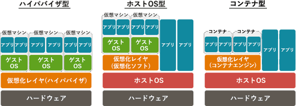

# [令和3年秋期 午前 問14](https://www.ap-siken.com/kakomon/03_aki/q14.html)

#問題 #テクノロジ #システム構成要素 #システムの構成

解説を表示解説を隠す

<strong>問14</strong>　コンテナ型仮想化の説明として，適切なものはどれか。

<ul class="ap-choices">
<li class="ap-choice-item ap-correct">

ア　アプリケーションの起動に必要なプログラムやライブラリなどをまとめ，ホストOSで動作させるので，独立性を保ちながら複数のアプリケーションを稼働できる。

正しい。コンテナ型は、ホストOS上のプロセスとして作成した独立空間によって<a href="用語/仮想化" class="internal-link" data-href="用語/仮想化">仮想化</a>の仕組みを提供します。

</li>
<li class="ap-choice-item ap-wrong">

イ　サーバで仮想化ソフトウェアを動かし，その上で複数のゲストOSを稼働させるので，サーバのOSとは異なるOSも稼働できる。

ハイパーバイザ型の説明です。コンテナ型ではゲストOSを使いません。

</li>
<li class="ap-choice-item ap-wrong">

ウ　サーバで実行されたアプリケーションの画面情報をクライアントに送信し，クライアントからは端末の操作情報がサーバに送信されるので，クライアントにアプリケーションをインストールしなくても利用できる。

これは<a href="用語/VDI" class="internal-link" data-href="用語/VDI">VDI</a>(Virtual Desktop Infrastructure)の説明です。

</li>
<li class="ap-choice-item ap-wrong">

エ　ホストOSで仮想化ソフトウェアを動かし，その上で複数のゲストOSを稼働させるので，物理サーバへアクセスするにはホストOSを経由する必要がある。

ホストOS型の説明です。コンテナ型ではゲストOSを使いません。

</li>
</ul>

<h4>解説</h4>

<a href="用語/仮想化" class="internal-link" data-href="用語/仮想化">仮想化</a>のアーキテクチャは、ハイパーバイザ型、ホスト型、コンテナ型に大別されます。

コンテナ型は、ホストOS上にコンテナという互いに独立した空間を用意し、その空間上でライブラリやアプリケーションを動かす仕組みです。ゲストOSを起動する必要がないため低リソースで<a href="用語/仮想化" class="internal-link" data-href="用語/仮想化">仮想化</a>環境を構築することができます。しかし、ホストOSとは別のOSの<a href="用語/仮想環境" class="internal-link" data-href="用語/仮想環境">仮想環境</a>を構築することができないという制約もあります。

アは、上記のとおりコンテナ型の説明であり正解です。

イは、ハイパーバイザ型の説明です。コンテナ型ではゲストOSを使いません。

ウは、<a href="用語/VDI" class="internal-link" data-href="用語/VDI">VDI</a>(Virtual Desktop Infrastructure)の説明です。

エは、ホストOS型の説明です。コンテナ型ではゲストOSを使いません。

