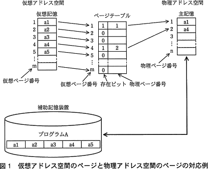

# [令和3年秋期 午前 問19](https://www.ap-siken.com/kakomon/03_aki/q19.html)

#問題 #テクノロジ #ソフトウェア #オペレーティングシステム

解説を表示解説を隠す

<strong>問19</strong>　仮想記憶方式における補助記憶の機能はどれか。

<ul class="ap-choices">
<li class="ap-choice-item ap-correct">

ア　主記憶からページアウトされたページを格納する。

正しい。<a href="用語/ページアウト" class="internal-link" data-href="用語/ページアウト">ページアウト</a>によって<a href="用語/主記憶" class="internal-link" data-href="用語/主記憶">主記憶</a>から追い出されたページは、<a href="用語/補助記憶" class="internal-link" data-href="用語/補助記憶">補助記憶</a>に格納され、次に<a href="用語/ページイン" class="internal-link" data-href="用語/ページイン">ページイン</a>するときを待ちます。

</li>
<li class="ap-choice-item ap-wrong">

イ　主記憶が更新された際に，更新前の内容を保存する。

<a href="用語/主記憶" class="internal-link" data-href="用語/主記憶">主記憶</a>上のページが更新されたとき、<a href="用語/補助記憶" class="internal-link" data-href="用語/補助記憶">補助記憶</a>上の対応するページは、<a href="用語/ページアウト" class="internal-link" data-href="用語/ページアウト">ページアウト</a>があるまで更新前の内容を保持することになります。しかし、その更新前の内容を別の場所に保存しておく機能はありません。

</li>
<li class="ap-choice-item ap-wrong">

ウ　主記憶と連続した仮想アドレスを割り当てて，主記憶を拡張する。実アドレスと仮想アドレスはともに0から割り振られる

実アドレス、仮想アドレスともにアドレス番号0から割り振られます。

</li>
<li class="ap-choice-item ap-wrong">

エ　主記憶のバックアップとして，主記憶の内容を格納する。仮想記憶は主記憶のバックアップではない

<a href="用語/仮想記憶" class="internal-link" data-href="用語/仮想記憶">仮想記憶</a>は<a href="用語/主記憶" class="internal-link" data-href="用語/主記憶">主記憶</a>の<a href="用語/バックアップ" class="internal-link" data-href="用語/バックアップ">バックアップ</a>ではありません。

</li>
</ul>

<h4>解説</h4>

<a href="用語/仮想記憶" class="internal-link" data-href="用語/仮想記憶">仮想記憶</a>は、HDDやSSDなどの<a href="用語/補助記憶" class="internal-link" data-href="用語/補助記憶">補助記憶</a>装置を使用して、<a href="用語/主記憶" class="internal-link" data-href="用語/主記憶">主記憶</a>の見掛け上の容量を増加させる仕組みです。現在実行中のプログラムで使う部分を<a href="用語/主記憶" class="internal-link" data-href="用語/主記憶">主記憶</a>装置（<a href="用語/実記憶" class="internal-link" data-href="用語/実記憶">実記憶</a>）に、優先度の低い部分を<a href="用語/補助記憶" class="internal-link" data-href="用語/補助記憶">補助記憶</a>装置（<a href="用語/仮想記憶" class="internal-link" data-href="用語/仮想記憶">仮想記憶</a>）に退避させ、プログラムの実行に合わせて両者の間でデータの入れ替えを行うことで、<a href="用語/主記憶" class="internal-link" data-href="用語/主記憶">主記憶</a>の実容量で扱えるよりも大きな、または多くのプログラムを同時に展開できるようにしています。<a href="用語/仮想記憶" class="internal-link" data-href="用語/仮想記憶">仮想記憶</a>の代表的な方式であるページング方式は、<a href="用語/主記憶" class="internal-link" data-href="用語/主記憶">主記憶</a>をページという固定長のブロックで分割、<a href="用語/補助記憶" class="internal-link" data-href="用語/補助記憶">補助記憶</a>も同じようにページ単位に分割してページ単位で管理します。<a href="用語/補助記憶" class="internal-link" data-href="用語/補助記憶">補助記憶</a>には<a href="用語/主記憶" class="internal-link" data-href="用語/主記憶">主記憶</a>で使う予定のページが格納されていて、あるページがプログラムから要求されると、<a href="用語/補助記憶" class="internal-link" data-href="用語/補助記憶">補助記憶</a>から<a href="用語/主記憶" class="internal-link" data-href="用語/主記憶">主記憶</a>にそのページが移されます。逆に<a href="用語/主記憶" class="internal-link" data-href="用語/主記憶">主記憶</a>から追い出されたページは<a href="用語/補助記憶" class="internal-link" data-href="用語/補助記憶">補助記憶</a>上に格納されています。

