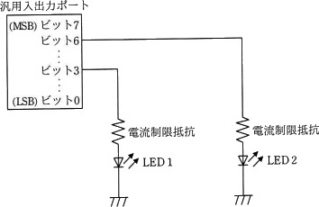
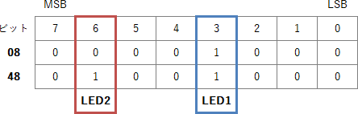

# [令和3年秋期 午前 問23](https://www.ap-siken.com/kakomon/03_aki/q23.html)

#問題 #テクノロジ #ハードウェア

解説を表示解説を隠す

<strong>問23</strong>　マイコンの汎用入出力ポートに接続されたLED1を，LED2の状態を変化させずに点灯したい。汎用入出力ポートに書き込む値として，適切なものはどれか。ここで，使用されている汎用入出力ポートのビットは全て出力モードに設定されていて，出力値の読出しが可能で，この操作の間に汎用入出力ポートに対する他の操作は行われないものとする。 

<ul class="ap-choices">
<li class="ap-choice-item ap-wrong">

ア　汎用入出力ポートから読み出した値と16進数の08との論理積

<a href="用語/ビット" class="internal-link" data-href="用語/ビット">ビット</a>3は"1"との<a href="用語/論理積" class="internal-link" data-href="用語/論理積">論理積</a>、<a href="用語/ビット" class="internal-link" data-href="用語/ビット">ビット</a>6は"0"との<a href="用語/論理積" class="internal-link" data-href="用語/論理積">論理積</a>となります。LED1が点灯せず、点灯していたLED2が消灯してしまうため誤りです。

</li>
<li class="ap-choice-item ap-correct">

イ　汎用入出力ポートから読み出した値と16進数の08との論理和

正しい。<a href="用語/ビット" class="internal-link" data-href="用語/ビット">ビット</a>3は"1"との<a href="用語/論理和" class="internal-link" data-href="用語/論理和">論理和</a>、<a href="用語/ビット" class="internal-link" data-href="用語/ビット">ビット</a>6は"0"との<a href="用語/論理和" class="internal-link" data-href="用語/論理和">論理和</a>となります。<a href="用語/ビット" class="internal-link" data-href="用語/ビット">ビット</a>3は常に"1"で点灯、<a href="用語/ビット" class="internal-link" data-href="用語/ビット">ビット</a>6は読み出した<a href="用語/ビット" class="internal-link" data-href="用語/ビット">ビット</a>がそのまま出力されます。

</li>
<li class="ap-choice-item ap-wrong">

ウ　汎用入出力ポートから読み出した値と16進数の48との論理積

<a href="用語/ビット" class="internal-link" data-href="用語/ビット">ビット</a>3は"1"との<a href="用語/論理積" class="internal-link" data-href="用語/論理積">論理積</a>、<a href="用語/ビット" class="internal-link" data-href="用語/ビット">ビット</a>6も"1"との<a href="用語/論理積" class="internal-link" data-href="用語/論理積">論理積</a>となります。<a href="用語/ビット" class="internal-link" data-href="用語/ビット">ビット</a>3が"1"とならず、LED1を点灯させることができないため誤りです。

</li>
<li class="ap-choice-item ap-wrong">

エ　汎用入出力ポートから読み出した値と16進数の48との論理和

<a href="用語/ビット" class="internal-link" data-href="用語/ビット">ビット</a>3は"1"との<a href="用語/論理和" class="internal-link" data-href="用語/論理和">論理和</a>、<a href="用語/ビット" class="internal-link" data-href="用語/ビット">ビット</a>6も"1"との<a href="用語/論理和" class="internal-link" data-href="用語/論理和">論理和</a>となります。<a href="用語/ビット" class="internal-link" data-href="用語/ビット">ビット</a>6が常に"1"となり、消灯していたLED2が点灯してしまうため誤りです。

</li>
</ul>

<h4>解説</h4>

16進数の 08 と 48 を2進数表記にすると以下のようになります。

08(16) = 0000 1000(2) 48(16) = 0100 1000(2)

LSB（最下位<a href="用語/ビット" class="internal-link" data-href="用語/ビット">ビット</a>）が<a href="用語/ビット" class="internal-link" data-href="用語/ビット">ビット</a>0、MSB（最上位<a href="用語/ビット" class="internal-link" data-href="用語/ビット">ビット</a>）が<a href="用語/ビット" class="internal-link" data-href="用語/ビット">ビット</a>7なので、設問の図の<a href="用語/ビット" class="internal-link" data-href="用語/ビット">ビット</a>3（LED1）と<a href="用語/ビット" class="internal-link" data-href="用語/ビット">ビット</a>6（LED2）と<a href="用語/ビット" class="internal-link" data-href="用語/ビット">ビット</a>マスクの位置はそれぞれ以下のように対応します。

<a href="用語/LED" class="internal-link" data-href="用語/LED">LED</a>を点灯させるには対応する<a href="用語/ビット" class="internal-link" data-href="用語/ビット">ビット</a>に"1"を出力します。LED2を変化させずに、LED1を点灯させるには、汎用<a href="用語/入出力ポート" class="internal-link" data-href="用語/入出力ポート">入出力ポート</a>から読み出した値の<a href="用語/ビット" class="internal-link" data-href="用語/ビット">ビット</a>6はそのまま、<a href="用語/ビット" class="internal-link" data-href="用語/ビット">ビット</a>3を"1"にした値を書き込めば良いことになります。<a href="用語/ビット" class="internal-link" data-href="用語/ビット">ビット</a>6について読み出した<a href="用語/ビット" class="internal-link" data-href="用語/ビット">ビット</a>を変化させずにそのまま出力するには、"1"との<a href="用語/論理積" class="internal-link" data-href="用語/論理積">論理積</a>(AND)をとるか、"0"との<a href="用語/論理和" class="internal-link" data-href="用語/論理和">論理和</a>(OR)をとることになります。<a href="用語/ビット" class="internal-link" data-href="用語/ビット">ビット</a>3については必ず1を出力したいので"1"との<a href="用語/論理和" class="internal-link" data-href="用語/論理和">論理和</a>をとるのが必須です。この2つの条件を組み合わせると、<a href="用語/ビット" class="internal-link" data-href="用語/ビット">ビット</a>3は"1"で<a href="用語/論理和" class="internal-link" data-href="用語/論理和">論理和</a>をとる、<a href="用語/論理和" class="internal-link" data-href="用語/論理和">論理和</a>を使用するため<a href="用語/ビット" class="internal-link" data-href="用語/ビット">ビット</a>6は"0"を使うことになります。以上より、「読み出した値と16進数08の<a href="用語/論理和" class="internal-link" data-href="用語/論理和">論理和</a>」が適切とわかります。

アは、<a href="用語/ビット" class="internal-link" data-href="用語/ビット">ビット</a>3は"1"との<a href="用語/論理積" class="internal-link" data-href="用語/論理積">論理積</a>、<a href="用語/ビット" class="internal-link" data-href="用語/ビット">ビット</a>6は"0"との<a href="用語/論理積" class="internal-link" data-href="用語/論理積">論理積</a>となります。LED1が点灯せず、点灯していたLED2が消灯してしまうため誤りです。

イは、正しい。<a href="用語/ビット" class="internal-link" data-href="用語/ビット">ビット</a>3は"1"との<a href="用語/論理和" class="internal-link" data-href="用語/論理和">論理和</a>、<a href="用語/ビット" class="internal-link" data-href="用語/ビット">ビット</a>6は"0"との<a href="用語/論理和" class="internal-link" data-href="用語/論理和">論理和</a>となります。<a href="用語/ビット" class="internal-link" data-href="用語/ビット">ビット</a>3は常に"1"で点灯、<a href="用語/ビット" class="internal-link" data-href="用語/ビット">ビット</a>6は読み出した<a href="用語/ビット" class="internal-link" data-href="用語/ビット">ビット</a>がそのまま出力されます。

ウは、<a href="用語/ビット" class="internal-link" data-href="用語/ビット">ビット</a>3は"1"との<a href="用語/論理積" class="internal-link" data-href="用語/論理積">論理積</a>、<a href="用語/ビット" class="internal-link" data-href="用語/ビット">ビット</a>6も"1"との<a href="用語/論理積" class="internal-link" data-href="用語/論理積">論理積</a>となります。<a href="用語/ビット" class="internal-link" data-href="用語/ビット">ビット</a>3が"1"とならず、LED1を点灯させることができないため誤りです。

エは、<a href="用語/ビット" class="internal-link" data-href="用語/ビット">ビット</a>3は"1"との<a href="用語/論理和" class="internal-link" data-href="用語/論理和">論理和</a>、<a href="用語/ビット" class="internal-link" data-href="用語/ビット">ビット</a>6も"1"との<a href="用語/論理和" class="internal-link" data-href="用語/論理和">論理和</a>となります。<a href="用語/ビット" class="internal-link" data-href="用語/ビット">ビット</a>6が常に"1"となり、消灯していたLED2が点灯してしまうため誤りです。

