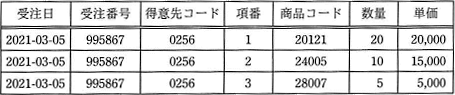
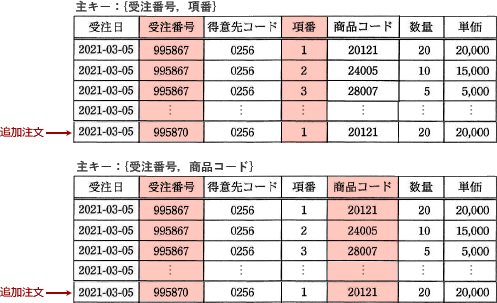

# [令和3年秋期 午前 問28](https://www.ap-siken.com/kakomon/03_aki/q28.html)

#問題 #テクノロジ #データベース #データベース設計

解説を表示解説を隠す

<strong>問28</strong>　受注入力システムによって作成される次の表に関する記述のうち，適切なものはどれか。受注番号は受注ごとに新たに発行される番号であり，項番は1回の受注で商品コード別に連番で発行される番号である。なお，単価は商品コードによって一意に定まる。 

<ul class="ap-choices">
<li class="ap-choice-item ap-wrong">

ア　第1正規形でない。

1つの<a href="用語/属性" class="internal-link" data-href="用語/属性">属性</a>の中に繰り返し項目が含まれていないため、<a href="用語/第1正規形" class="internal-link" data-href="用語/第1正規形">第1正規形</a>を満たしていると判断できます。

</li>
<li class="ap-choice-item ap-correct">

イ　第1正規形であるが第2正規形ではない。

正しい。<a href="用語/主キー" class="internal-link" data-href="用語/主キー">主キー</a>の一部によって定まる<a href="用語/属性" class="internal-link" data-href="用語/属性">属性</a>が別表に分離されていないため、<a href="用語/第2正規形" class="internal-link" data-href="用語/第2正規形">第2正規形</a>ではないと判断できます。

</li>
<li class="ap-choice-item ap-wrong">

ウ　第2正規形であるが第3正規形ではない。

受注日・得意先コードは受注番号に、単価は商品コードにそれぞれ関数従属しますが、設問の表では<a href="用語/主キー" class="internal-link" data-href="用語/主キー">主キー</a>への<a href="用語/部分関数従属" class="internal-link" data-href="用語/部分関数従属">部分関数従属</a>が別表に分離されていないため<a href="用語/第2正規形" class="internal-link" data-href="用語/第2正規形">第2正規形</a>ではありません。

</li>
<li class="ap-choice-item ap-wrong">

エ　第3正規形である。

<a href="用語/第2正規形" class="internal-link" data-href="用語/第2正規形">第2正規形</a>を満たしていないため、<a href="用語/第3正規形" class="internal-link" data-href="用語/第3正規形">第3正規形</a>であるとは言えません。

</li>
</ul>

<h4>解説</h4>

<a href="用語/第3正規形" class="internal-link" data-href="用語/第3正規形">第3正規形</a>までの<a href="用語/正規化" class="internal-link" data-href="用語/正規化">正規化</a>は次の手順で行います。

第1正規化：繰り返し項目をなくす 第2正規化：<a href="用語/主キー" class="internal-link" data-href="用語/主キー">主キー</a>の一部によって一意に決まる<a href="用語/属性" class="internal-link" data-href="用語/属性">属性</a>を別表に移す 第3正規化：<a href="用語/主キー" class="internal-link" data-href="用語/主キー">主キー</a>以外の<a href="用語/属性" class="internal-link" data-href="用語/属性">属性</a>によって一意に決まる<a href="用語/属性" class="internal-link" data-href="用語/属性">属性</a>を別表に移す

設問の表ですが、まず1つの<a href="用語/属性" class="internal-link" data-href="用語/属性">属性</a>の中に繰り返し項目が含まれていないため<a href="用語/第1正規形" class="internal-link" data-href="用語/第1正規形">第1正規形</a>を満たしていると判断できます。次の手順は第2正規化の手続きで必要となる<a href="用語/主キー" class="internal-link" data-href="用語/主キー">主キー</a>の特定ですが、設問の表だけを見ても1回の受注データのみなので<a href="用語/主キー" class="internal-link" data-href="用語/主キー">主キー</a>がはっきりしません。しかし下図のように同じ日に同じ顧客から同じ商品の追加注文があったと仮定すると、ある行を特定できる<a href="用語/属性" class="internal-link" data-href="用語/属性">属性</a>は「"受注番号"と"項番"の組合せ」若しくは「"受注番号"と"商品コード"の組合せ」であることが明確になります。

<a href="用語/第2正規形" class="internal-link" data-href="用語/第2正規形">第2正規形</a>への正規化では<a href="用語/主キー" class="internal-link" data-href="用語/主キー">主キー</a>の一部によって定まる<a href="用語/属性" class="internal-link" data-href="用語/属性">属性</a>を別表に移します。"受注日"と"得意先コード"は"受注番号"に、"単価"は"商品コード"にそれぞれ関数従属しますが、設問の表ではどちらを<a href="用語/主キー" class="internal-link" data-href="用語/主キー">主キー</a>とした場合でも<a href="用語/主キー" class="internal-link" data-href="用語/主キー">主キー</a>への<a href="用語/部分関数従属" class="internal-link" data-href="用語/部分関数従属">部分関数従属</a>が別表に分離されていないため<a href="用語/第2正規形" class="internal-link" data-href="用語/第2正規形">第2正規形</a>ではないと判断できます。したがって「<a href="用語/第1正規形" class="internal-link" data-href="用語/第1正規形">第1正規形</a>であるが<a href="用語/第2正規形" class="internal-link" data-href="用語/第2正規形">第2正規形</a>ではない」という記述が適切です。

