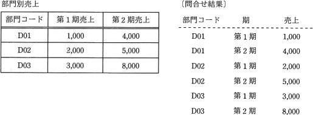
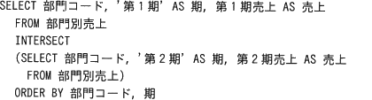
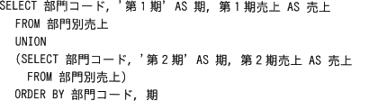
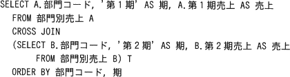
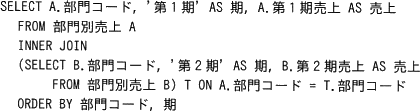
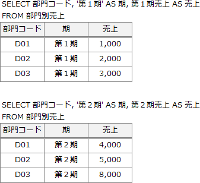
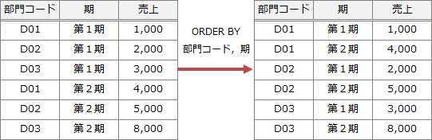
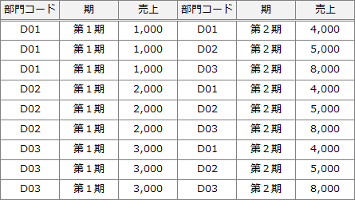
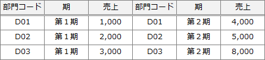

# [令和3年秋期 午前 問29](https://www.ap-siken.com/kakomon/03_aki/q29.html)

#問題 #テクノロジ #データベース #データ操作

解説を表示解説を隠す

<strong>問29</strong>　"部門別売上"表から，部門コードごと，期ごとの売上を得るSQL文はどれか。 

<ul class="ap-choices">
<li class="ap-choice-item ap-wrong">

ア　

INTERSECT（共通）は2つの<a href="用語/関係" class="internal-link" data-href="用語/関係">関係</a>の共通集合を得る演算です。第1期と第2期で(部門コード, 期, 売上)が異なるため共通する行はなく，結果なしとなります。

</li>
<li class="ap-choice-item ap-correct">

イ　

正しい。UNION（和）は2つの<a href="用語/関係" class="internal-link" data-href="用語/関係">関係</a>の<a href="用語/和集合" class="internal-link" data-href="用語/和集合">和集合</a>を得る演算で，2つのSELECTの結果を縦に連結し，設問の<a href="用語/問合せ" class="internal-link" data-href="用語/問合せ">問合せ</a>結果と一致します。

</li>
<li class="ap-choice-item ap-wrong">

ウ　

CROSS JOIN（直積）は2つの<a href="用語/関係" class="internal-link" data-href="用語/関係">関係</a>の行のすべての組合せを得る演算です。どちらも3行あるため結果は3×3＝9行となり，<a href="用語/問合せ" class="internal-link" data-href="用語/問合せ">問合せ</a>結果と異なります。

</li>
<li class="ap-choice-item ap-wrong">

エ　

INNER JOIN（内部結合）は共通する<a href="用語/属性" class="internal-link" data-href="用語/属性">属性</a>で2つの<a href="用語/関係" class="internal-link" data-href="用語/関係">関係</a>を結び付ける演算です。部門コードで結合しても期が第1期と第2期で異なるため，想定の6行の結果にはなりません。

</li>
</ul>

<h4>解説</h4>

まず、どの<a href="用語/SQL" class="internal-link" data-href="用語/SQL">SQL</a>文にも共通している2つの<a href="用語/SELECT文" class="internal-link" data-href="用語/SELECT文">SELECT文</a>から得られる中間表を考えます。それぞれ以下の結果となります。

2つの中間表をINTERSECT（共通）、UNION（和）、CROSS JOIN（直積）、INNER JOIN（内部結合）を行うとそれぞれ以下のようになります。

INTERSECT（共通）は2つの<a href="用語/関係" class="internal-link" data-href="用語/関係">関係</a>に共通集合を得る演算です。共通する行はないので"結果なし"となります。

UNION（和）は2つの<a href="用語/関係" class="internal-link" data-href="用語/関係">関係</a>の<a href="用語/和集合" class="internal-link" data-href="用語/和集合">和集合</a>を得る演算です。1つ目の<a href="用語/関係" class="internal-link" data-href="用語/関係">関係</a>に2つ目の<a href="用語/関係" class="internal-link" data-href="用語/関係">関係</a>が足される感じになるので、設問の<a href="用語/問合せ" class="internal-link" data-href="用語/問合せ">問合せ</a>結果と同じになります。

CROSS JOIN（直積）は、2つの<a href="用語/関係" class="internal-link" data-href="用語/関係">関係</a>に存在する行のすべての組み合わせを得る演算です。どちらの<a href="用語/関係" class="internal-link" data-href="用語/関係">関係</a>も3行ずつあるので、結果表は「3×3＝9行」で構成される表となるので誤りです。

INNER JOIN（内部結合）は、2つの<a href="用語/関係" class="internal-link" data-href="用語/関係">関係</a>を共通する<a href="用語/属性" class="internal-link" data-href="用語/属性">属性</a>で結び付ける演算です。結合相手が存在する行だけが残ります。2つの<a href="用語/関係" class="internal-link" data-href="用語/関係">関係</a>を部門コードで結合すると、結果表は設問の<a href="用語/問合せ" class="internal-link" data-href="用語/問合せ">問合せ</a>結果とは異なるので誤りです。

