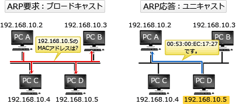

# [令和3年秋期 午前 問32](https://www.ap-siken.com/kakomon/03_aki/q32.html)

#問題 #テクノロジ #ネットワーク #通信プロトコル

解説を表示解説を隠す

<strong>問32</strong>　TCP/IPネットワークにおけるARPの説明として，適切なものはどれか。

<ul class="ap-choices">
<li class="ap-choice-item ap-correct">

ア　IPアドレスからMACアドレスを得るプロトコルである。

正しい。<a href="用語/ARP" class="internal-link" data-href="用語/ARP">ARP</a>の説明です。

</li>
<li class="ap-choice-item ap-wrong">

イ　IPネットワークにおける誤り制御のためのプロトコルである。

これは<a href="用語/TCP" class="internal-link" data-href="用語/TCP">TCP</a>(Transmission Control Protocol)の説明です。

</li>
<li class="ap-choice-item ap-wrong">

ウ　ゲートウェイ間のホップ数によって経路を制御するプロトコルである。

これはRIP(Routing Information Protocol)の説明です。

</li>
<li class="ap-choice-item ap-wrong">

エ　端末に対して動的にIPアドレスを割り当てるためのプロトコルである。

これは<a href="用語/DHCP" class="internal-link" data-href="用語/DHCP">DHCP</a>(Dynamic Host Configuration Protocol)の説明です。

</li>
</ul>

<h4>解説</h4>

<a href="用語/ARP" class="internal-link" data-href="用語/ARP">ARP</a>(Address Resolution Protocol)は、<a href="用語/IPアドレス" class="internal-link" data-href="用語/IPアドレス">IPアドレス</a>から対応する機器の<a href="用語/MAC" class="internal-link" data-href="用語/MAC">MAC</a>アドレスを取得するプロトコルです。<a href="用語/ARP" class="internal-link" data-href="用語/ARP">ARP</a>が、<a href="用語/IPアドレス" class="internal-link" data-href="用語/IPアドレス">IPアドレス</a>から<a href="用語/MAC" class="internal-link" data-href="用語/MAC">MAC</a>アドレスを取得する手順は以下のとおりです。

1. 要求<a href="用語/パケット" class="internal-link" data-href="用語/パケット">パケット</a>に、<a href="用語/MAC" class="internal-link" data-href="用語/MAC">MAC</a>アドレスを得たい<a href="用語/IPアドレス" class="internal-link" data-href="用語/IPアドレス">IPアドレス</a>と、送信元の<a href="用語/IPアドレス" class="internal-link" data-href="用語/IPアドレス">IPアドレス</a>・<a href="用語/MAC" class="internal-link" data-href="用語/MAC">MAC</a>アドレスを格納して、同一セグメント内に<a href="用語/ブロードキャスト" class="internal-link" data-href="用語/ブロードキャスト">ブロードキャスト</a>する。 2. 要求<a href="用語/パケット" class="internal-link" data-href="用語/パケット">パケット</a>を受け取った各ノードは、解決目的の<a href="用語/IPアドレス" class="internal-link" data-href="用語/IPアドレス">IPアドレス</a>を確認し、自分の<a href="用語/IPアドレス" class="internal-link" data-href="用語/IPアドレス">IPアドレス</a>であれば、自分の<a href="用語/MAC" class="internal-link" data-href="用語/MAC">MAC</a>アドレスを送信元に伝える。

したがって正解は「ア」です。

