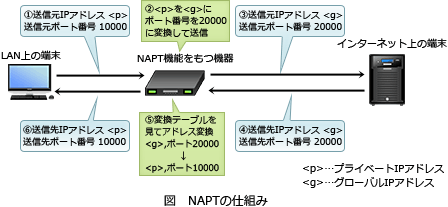

# [令和3年秋期 午前 問33](https://www.ap-siken.com/kakomon/03_aki/q33.html)

#問題 #テクノロジ #ネットワーク #ネットワーク方式

解説を表示解説を隠す

<strong>問33</strong>　PCが，NAPT(IPマスカレード)機能を有効にしているルータを経由してインターネットに接続されているとき，PCからインターネットに送出されるパケットのTCPとIPのヘッダーのうち，ルータを経由する際に書き換えられるものはどれか。

<ul class="ap-choices">
<li class="ap-choice-item ap-wrong">

ア　宛先のIPアドレスと宛先のポート番号

PCからインターネットへ送出する方向では、宛先の<a href="用語/IPアドレス" class="internal-link" data-href="用語/IPアドレス">IPアドレス</a>と宛先の<a href="用語/ポート番号" class="internal-link" data-href="用語/ポート番号">ポート番号</a>は書き換えられません。

</li>
<li class="ap-choice-item ap-wrong">

イ　宛先のIPアドレスと送信元のIPアドレス

送信元の<a href="用語/IPアドレス" class="internal-link" data-href="用語/IPアドレス">IPアドレス</a>は書き換えられますが、宛先の<a href="用語/IPアドレス" class="internal-link" data-href="用語/IPアドレス">IPアドレス</a>は書き換えられません。両方をセットで挙げた組合せは不適切です。

</li>
<li class="ap-choice-item ap-wrong">

ウ　送信元のポート番号と宛先のポート番号

送信元の<a href="用語/ポート番号" class="internal-link" data-href="用語/ポート番号">ポート番号</a>は書き換えられますが、宛先の<a href="用語/ポート番号" class="internal-link" data-href="用語/ポート番号">ポート番号</a>は通常そのままです。

</li>
<li class="ap-choice-item ap-correct">

エ　送信元のポート番号と送信元のIPアドレス

正しい。<a href="用語/NAPT" class="internal-link" data-href="用語/NAPT">NAPT</a>は送信元の<a href="用語/IPアドレス" class="internal-link" data-href="用語/IPアドレス">IPアドレス</a>と<a href="用語/ポート番号" class="internal-link" data-href="用語/ポート番号">ポート番号</a>をグローバル側に変換します。

</li>
</ul>

<h4>解説</h4>

<a href="用語/NAPT" class="internal-link" data-href="用語/NAPT">NAPT</a>(Network Address Port Translation)は、<a href="用語/プライベートIPアドレス" class="internal-link" data-href="用語/プライベートIPアドレス">プライベートIPアドレス</a>と<a href="用語/グローバルIPアドレス" class="internal-link" data-href="用語/グローバルIPアドレス">グローバルIPアドレス</a>を1対1で相互変換する<a href="用語/NAT" class="internal-link" data-href="用語/NAT">NAT</a>の考え方に、<a href="用語/ポート番号" class="internal-link" data-href="用語/ポート番号">ポート番号</a>でのクライアント識別を組み合わせた技術です。ホストごとにユニークな<a href="用語/ポート番号" class="internal-link" data-href="用語/ポート番号">ポート番号</a>を割り当てることで、1つの<a href="用語/グローバルIPアドレス" class="internal-link" data-href="用語/グローバルIPアドレス">グローバルIPアドレス</a>で複数の<a href="用語/プライベートIPアドレス" class="internal-link" data-href="用語/プライベートIPアドレス">プライベートIPアドレス</a>を持つノードを同時にインターネット接続させることが可能です。<a href="用語/NAPT" class="internal-link" data-href="用語/NAPT">NAPT</a>対応機器は、クライアントの<a href="用語/プライベートIPアドレス" class="internal-link" data-href="用語/プライベートIPアドレス">プライベートIPアドレス</a>と<a href="用語/ポート番号" class="internal-link" data-href="用語/ポート番号">ポート番号</a>を<a href="用語/グローバルIPアドレス" class="internal-link" data-href="用語/グローバルIPアドレス">グローバルIPアドレス</a>と任意の<a href="用語/ポート番号" class="internal-link" data-href="用語/ポート番号">ポート番号</a>に変換し、変換前の情報を変換テーブルに記録しておきます。インターネットから応答が返ってきたときには、宛先<a href="用語/ポート番号" class="internal-link" data-href="用語/ポート番号">ポート番号</a>を見て変換テーブルから対応する<a href="用語/プライベートIPアドレス" class="internal-link" data-href="用語/プライベートIPアドレス">プライベートIPアドレス</a>を探し、変換前の<a href="用語/プライベートIPアドレス" class="internal-link" data-href="用語/プライベートIPアドレス">プライベートIPアドレス</a>と<a href="用語/ポート番号" class="internal-link" data-href="用語/ポート番号">ポート番号</a>に戻してクライアントに送信します。

本問ではPCからインターネットに送出される<a href="用語/パケット" class="internal-link" data-href="用語/パケット">パケット</a>について問われているので、<a href="用語/ルータ" class="internal-link" data-href="用語/ルータ">ルータ</a>経由時に置き換えられる<a href="用語/ヘッダー" class="internal-link" data-href="用語/ヘッダー">ヘッダー</a>情報は送信元の<a href="用語/ポート番号" class="internal-link" data-href="用語/ポート番号">ポート番号</a>と送信元の<a href="用語/IPアドレス" class="internal-link" data-href="用語/IPアドレス">IPアドレス</a>になります。したがって「エ」の組合せが正解です。

