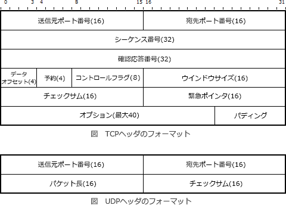

# [令和3年秋期 午前 問34](https://www.ap-siken.com/kakomon/03_aki/q34.html)

#問題 #テクノロジ #ネットワーク #通信プロトコル

解説を表示解説を隠す

<strong>問34</strong>　UDPのヘッダーフィールドにはないが，TCPのヘッダーフィールドには含まれる情報はどれか。

<ul class="ap-choices">
<li class="ap-choice-item ap-wrong">

ア　宛先ポート番号

宛先<a href="用語/ポート番号" class="internal-link" data-href="用語/ポート番号">ポート番号</a>は<a href="用語/TCP" class="internal-link" data-href="用語/TCP">TCP</a>と<a href="用語/UDP" class="internal-link" data-href="用語/UDP">UDP</a>の両方の<a href="用語/ヘッダー" class="internal-link" data-href="用語/ヘッダー">ヘッダー</a>に含まれる情報です。

</li>
<li class="ap-choice-item ap-correct">

イ　シーケンス番号

正しい。シーケンス番号は<a href="用語/TCP" class="internal-link" data-href="用語/TCP">TCP</a>のみの<a href="用語/ヘッダー" class="internal-link" data-href="用語/ヘッダー">ヘッダー</a>フィールドです。

</li>
<li class="ap-choice-item ap-wrong">

ウ　送信元ポート番号

送信元<a href="用語/ポート番号" class="internal-link" data-href="用語/ポート番号">ポート番号</a>は<a href="用語/TCP" class="internal-link" data-href="用語/TCP">TCP</a>と<a href="用語/UDP" class="internal-link" data-href="用語/UDP">UDP</a>の両方の<a href="用語/ヘッダー" class="internal-link" data-href="用語/ヘッダー">ヘッダー</a>に含まれる情報です。

</li>
<li class="ap-choice-item ap-wrong">

エ　チェックサム

<a href="用語/チェックサム" class="internal-link" data-href="用語/チェックサム">チェックサム</a>は<a href="用語/TCP" class="internal-link" data-href="用語/TCP">TCP</a>と<a href="用語/UDP" class="internal-link" data-href="用語/UDP">UDP</a>の両方の<a href="用語/ヘッダー" class="internal-link" data-href="用語/ヘッダー">ヘッダー</a>に含まれる情報です。

</li>
</ul>

<h4>解説</h4>

<a href="用語/TCP" class="internal-link" data-href="用語/TCP">TCP</a><a href="用語/ヘッダー" class="internal-link" data-href="用語/ヘッダー">ヘッダー</a>と<a href="用語/UDP" class="internal-link" data-href="用語/UDP">UDP</a><a href="用語/ヘッダー" class="internal-link" data-href="用語/ヘッダー">ヘッダー</a>の構造は元ページでは図で示されています。<a href="用語/TCP" class="internal-link" data-href="用語/TCP">TCP</a>は<a href="用語/信頼性" class="internal-link" data-href="用語/信頼性">信頼性</a>の高い通信を提供するためのプロトコルのため様々なフィールドがありますが、<a href="用語/UDP" class="internal-link" data-href="用語/UDP">UDP</a>は軽量かつリアルタイム性を重視した通信を提供するプロトコルのため非常に単純な構造です。

宛先／送信元<a href="用語/ポート番号" class="internal-link" data-href="用語/ポート番号">ポート番号</a>、<a href="用語/チェックサム" class="internal-link" data-href="用語/チェックサム">チェックサム</a>は両方にありますが、「シーケンス番号」は<a href="用語/TCP" class="internal-link" data-href="用語/TCP">TCP</a>のみにあり、<a href="用語/UDP" class="internal-link" data-href="用語/UDP">UDP</a>にはありません。シーケンス番号は送信したデータの位置を示す情報で、順序保証や再送制御などを行う<a href="用語/TCP" class="internal-link" data-href="用語/TCP">TCP</a>では必要な情報ですが、届けるだけの<a href="用語/UDP" class="internal-link" data-href="用語/UDP">UDP</a>では不要な情報だからです。したがって「イ」が正解となります。

