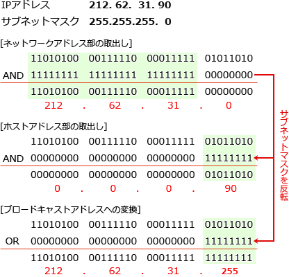

# [令和3年秋期 午前 問35](https://www.ap-siken.com/kakomon/03_aki/q35.html)

#問題 #テクノロジ #ネットワーク #通信プロトコル

解説を表示解説を隠す

<strong>問35</strong>　IPv4ネットワークにおいて，あるホストが属するサブネットのブロードキャストアドレスを，そのホストのIPアドレスとサブネットマスクから計算する方法として，適切なものはどれか。ここで，論理和，論理積はビットごとの演算とする。

<ul class="ap-choices">
<li class="ap-choice-item ap-wrong">

ア　IPアドレスの各ビットを反転したものとサブネットマスクとの論理積を取る。

<a href="用語/IPアドレス" class="internal-link" data-href="用語/IPアドレス">IPアドレス</a>を反転して<a href="用語/論理積" class="internal-link" data-href="用語/論理積">論理積</a>を取っても，ネットワーク部を保ちホスト部を全1にする<a href="用語/ブロードキャスト" class="internal-link" data-href="用語/ブロードキャスト">ブロードキャスト</a>アドレスにはならない。

</li>
<li class="ap-choice-item ap-wrong">

イ　IPアドレスの各ビットを反転したものとサブネットマスクとの論理和を取る。

<a href="用語/IPアドレス" class="internal-link" data-href="用語/IPアドレス">IPアドレス</a>を反転して<a href="用語/論理和" class="internal-link" data-href="用語/論理和">論理和</a>を取る方法は，サブネットの<a href="用語/ブロードキャスト" class="internal-link" data-href="用語/ブロードキャスト">ブロードキャスト</a>アドレスの求め方ではない。

</li>
<li class="ap-choice-item ap-wrong">

ウ　サブネットマスクの各ビットを反転したものとIPアドレスとの論理積を取る。

<a href="用語/サブネットマスク" class="internal-link" data-href="用語/サブネットマスク">サブネットマスク</a>を反転して<a href="用語/IPアドレス" class="internal-link" data-href="用語/IPアドレス">IPアドレス</a>と<a href="用語/論理積" class="internal-link" data-href="用語/論理積">論理積</a>を取るのは，<a href="用語/IPアドレス" class="internal-link" data-href="用語/IPアドレス">IPアドレス</a>からホストアドレス部を得る演算である。

</li>
<li class="ap-choice-item ap-correct">

エ　サブネットマスクの各ビットを反転したものとIPアドレスとの論理和を取る。

正しい。<a href="用語/サブネットマスク" class="internal-link" data-href="用語/サブネットマスク">サブネットマスク</a>を反転したビット列と<a href="用語/IPアドレス" class="internal-link" data-href="用語/IPアドレス">IPアドレス</a>の<a href="用語/論理和" class="internal-link" data-href="用語/論理和">論理和</a>で<a href="用語/ブロードキャスト" class="internal-link" data-href="用語/ブロードキャスト">ブロードキャスト</a>アドレスを得る。

</li>
</ul>

<h4>解説</h4>

<a href="用語/ブロードキャスト" class="internal-link" data-href="用語/ブロードキャスト">ブロードキャスト</a>アドレスは、あるネットワーク内のすべての端末に同じ内容を送信する(<a href="用語/ブロードキャスト" class="internal-link" data-href="用語/ブロードキャスト">ブロードキャスト</a>する)ときに使われる特別な宛先アドレスで、ホストアドレス部のビットを全て"1"にしたアドレスです。<a href="用語/IPアドレス" class="internal-link" data-href="用語/IPアドレス">IPアドレス</a>から<a href="用語/ブロードキャスト" class="internal-link" data-href="用語/ブロードキャスト">ブロードキャスト</a>アドレスを得るには、<a href="用語/サブネットマスク" class="internal-link" data-href="用語/サブネットマスク">サブネットマスク</a>でビットが"1"になっている部分（ネットワーク部）にはホストの<a href="用語/IPアドレス" class="internal-link" data-href="用語/IPアドレス">IPアドレス</a>をそのまま使い、<a href="用語/サブネットマスク" class="internal-link" data-href="用語/サブネットマスク">サブネットマスク</a>のビットが"0"になっている部分（ホストアドレス部）のビットは全て"1"にします。<a href="用語/サブネットマスク" class="internal-link" data-href="用語/サブネットマスク">サブネットマスク</a>をビット反転すると、ネットワーク部のビットが"0"、ホストアドレス部のビットが"1"になったビット列となります。これと対象<a href="用語/IPアドレス" class="internal-link" data-href="用語/IPアドレス">IPアドレス</a>を<a href="用語/論理和" class="internal-link" data-href="用語/論理和">論理和</a>(OR)演算すると、ネットワーク部は元の<a href="用語/IPアドレス" class="internal-link" data-href="用語/IPアドレス">IPアドレス</a>のビットそのまま、ホストアドレス部は全て"1"になったビット列（<a href="用語/ブロードキャスト" class="internal-link" data-href="用語/ブロードキャスト">ブロードキャスト</a>アドレス）を得ることができます。したがって「エ」の計算方法が適切です。なお、「ウ」は<a href="用語/IPアドレス" class="internal-link" data-href="用語/IPアドレス">IPアドレス</a>からホストアドレス部を得るための演算です。

