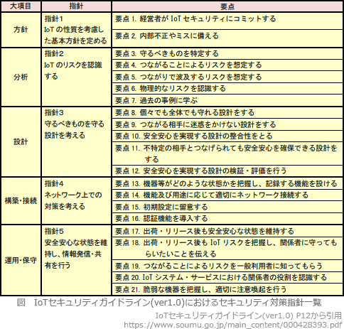

# [令和3年秋期 午前 問37](https://www.ap-siken.com/kakomon/03_aki/q37.html)

#問題 #テクノロジ #セキュリティ #情報セキュリティ管理

解説を表示解説を隠す

<strong>問37</strong>　IoT推進コンソーシアム，総務省，経済産業省が策定した"IoTセキュリティガイドライン(ver1.0)"における"要点17. 出荷・リリース後も安全安心な状態を維持する"に対策例として挙げられているものはどれか。

<ul class="ap-choices">
<li class="ap-choice-item ap-wrong">

ア　IoT機器及びIoTシステムが収集するセンサーデータ，個人情報などの情報の洗い出し，並びに保護すべきデータの特定

"分析"段階における"要点3. 守るべきものを特定する"の対策例です。出荷・リリース後の運用・保守段階の要点17ではありません。

</li>
<li class="ap-choice-item ap-correct">

イ　IoT機器のアップデート方法の検討，アップデートなどの機能の搭載，アップデートの実施

正しい。"運用・保守"段階における"要点17. 出荷・リリース後も安全安心な状態を維持する"の対策例です。

</li>
<li class="ap-choice-item ap-wrong">

ウ　IoT機器メーカー，IoTシステムやサービスの提供者，利用者の役割の整理

"運用・保守"段階における"要点20. IoTシステム・サービスにおける関係者の役割を認識する"の対策例です。要点17の対策例ではありません。

</li>
<li class="ap-choice-item ap-wrong">

エ　PDCAサイクルの実施，組織としてIoTシステムやサービスのリスクの認識，対策を行う体制の構築

"方針"段階における"要点1. 経営者がIoTセキュリティにコミットする"の対策例です。運用・保守段階の要点17ではありません。

</li>
</ul>

<h4>解説</h4>

IoTセキュリティガイドラインは、IoT特有の性質とセキュリティ対策の必要性を踏まえて、IoT機器やシステム、サービスについて、その関係者がセキュリティ確保等の観点から求められる基本的な取組を、セキュリティ・バイ・デザインを基本原則としつつ明確化するものです。IoT機器の開発から IoTサービスの提供までの流れを、「方針」「分析」「設計」「構築・接続」「運用・保守」の5つの段階に分けた上で、それぞれの段階に対するセキュリティ対策指針を示すとともに、指針ごとに具体的な要点を挙げ、ポイントと解説、対策例を記載しています。

本問の要点は、出荷・リリース後に関するものですから運用・保守段階に行うべき対策例を選ぶことになります。

アは"分析"段階における"要点3. 守るべきものを特定する"の対策例です。本ガイドラインでは、IoTの安全安心の観点で、守るべき本来機能や情報、つなげるための機能について特定することとしており、その対策例として、IoT機器・システムが収集するセンサーデータや個人情報（プライバシー含む)、所有する設計情報などの技術情報の洗い出しが挙げられています。

イは正しい。"運用・保守"段階における"要点17. 出荷・リリース後も安全安心な状態を維持する"の対策例です。本ガイドラインでは、IoTシステム・サービスの提供者等は、IoT機器のセキュリティ上重要なアップデート等を必要なタイミングで適切に実施する方法を検討し、適用することとしており、その対策例として、アップデート方法の検討、アップデート等の機能の搭載、アップデートの実施が挙げられています。

ウは"運用・保守"段階における"要点20. IoTシステム・サービスにおける関係者の役割を認識する"の対策例です。本ガイドラインでは、IoT機器メーカーやIoTシステム・サービス提供者及び一般利用者の役割を整理することとしており、その対策例として、IoT機器メーカーやIoTシステム・サービス提供者及び利用者の役割の整理が挙げられています。

エは"方針"段階における"要点1. 経営者がIoTセキュリティにコミットする"の対策例です。本ガイドラインでは、経営者は、「サイバーセキュリティ経営ガイドライン」を踏まえた対応を行う。IoTセキュリティの基本方針を企業として策定し社内に周知するとともに、継続的に実現状況を把握し、見直していく。また、そのために必要な体制・人材を整備することとしており、その対策例として、PDCAサイクルを回し、組織としてIoTシステム・サービスのリスクを認識し対策を行う体制を構築・維持することが挙げられています。

