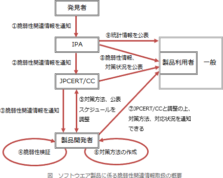

# [令和3年秋期 午前 問38](https://www.ap-siken.com/kakomon/03_aki/q38.html)

#問題 #テクノロジ #セキュリティ #情報セキュリティ管理

解説を表示解説を隠す

<strong>問38</strong>　ソフトウェア製品の脆弱性を第三者が発見し，その脆弱性をJPCERTコーディネーションセンターが製品開発者に通知した。その場合における製品開発者の対応のうち，"情報セキュリティ早期警戒パートナーシップガイドライン(2019年5月)"に照らして適切なものはどれか。

<ul class="ap-choices">
<li class="ap-choice-item ap-wrong">

ア　ISMS認証を取得している場合，ISMS認証の停止の手続をJPCERTコーディネーションセンターに依頼する。

ISMS認証の停止の手続きは本ガイドラインに規定されていません。脆弱性の発見が直ちにISMS認証の停止につながるわけではありません。

</li>
<li class="ap-choice-item ap-wrong">

イ　脆弱性関連の情報を集計し，統計情報としてIPAのWebサイトで公表する。

統計情報の公開は、IPAが行います（プロセス⑨）。製品開発者の役割ではありません。

</li>
<li class="ap-choice-item ap-correct">

ウ　脆弱性情報の公表に関するスケジュールをJPCERTコーディネーションセンターと調整し，決定する。

正しい。製品開発者の役割です（プロセス⑤）。

</li>
<li class="ap-choice-item ap-wrong">

エ　脆弱性の対応状況をJVNに書き込み，公表する。

JVN(Japan Vulnerability Notes)への書込みは、IPAとJPCERTコーディネーションセンターが行います（プロセス⑧）。製品開発者の役割ではありません。

</li>
</ul>

<h4>解説</h4>

情報セキュリティ早期警戒パートナーシップガイドラインは、IPAやJPCERTコーディネーションセンター(JPCERT/CC)等が共同で策定しているガイドラインで、脆弱性関連情報の適切な流通により、コンピュータ不正アクセス、コンピュータウイルス等による被害発生を抑制するために、関係者に推奨する行為をとりまとめたものです。具体的には、IPAが受付機関、JPCERT/CCが調整機関という役割を担い、発見者、製品開発者、ウェブサイト運営者と協力をしながら脆弱性関連情報に対処するための、その発見から公表に至るプロセスを詳述しています。本ガイドラインにおいて、ソフトウェア製品に係る脆弱性関連情報取扱の概要は、以下のようになっています。

1. 発見者は、IPAに脆弱性関連情報を届け出る 2. IPAは、受け取った脆弱性関連情報を、原則としてJPCERT/CCに通知する 3. JPCERT/CCは、脆弱性関連情報に関係する製品開発者を特定し、製品開発者に脆弱性関連情報を通知する 4. 製品開発者は、脆弱性検証を行い、その結果をJPCERT/CCに報告する 5. JPCERT/CCと製品開発者は、対策方法の作成や海外の調整機関との調整に要する期間、当該脆弱性情報流出に係るリスクを考慮しつつ、脆弱性情報の公表に関するスケジュールを調整し決定する 6. 製品開発者は、脆弱性情報の公表日までに対策方法を作成するよう努める 7. 製品開発者は、製品利用者に生じるリスクを低減できると判断した場合、JPCERT/CCと調整した上で、公表日以前に製品利用者に脆弱性検証の結果、対策方法および対応状況について通知することができる 8. IPAおよびJPCERT/CCは、脆弱性情報と、③にてJPCERT/CCから連絡したすべての製品開発者の脆弱性検証の結果、対策方法および対応状況を公表する 9. IPAは統計情報を、原則、四半期ごとに公表する

なお、ウェブアプリケーションに係る脆弱性関連情報の場合には、JPCERT/CCを介さずに、IPAからウェブサイト運営者に対して直接通知される取扱い手順となっています。

