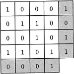
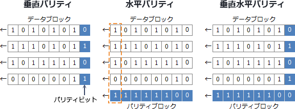
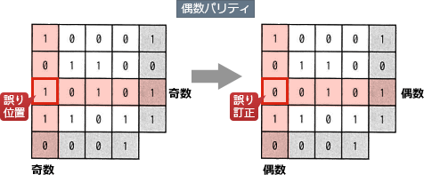

# [令和3年秋期 午前 問4](https://www.ap-siken.com/kakomon/03_aki/q4.html)

#問題 #テクノロジ #基礎理論 #通信に関する理論

解説を表示解説を隠す

<strong>問4</strong>　図のように16ビットのデータを4×4の正方形状に並べ，行と列にパリティビットを付加することによって何ビットまでの誤りを訂正できるか。ここで，図の網掛け部分はパリティビットを表す。 

<ul class="ap-choices">
<li class="ap-choice-item ap-correct">

ア　1

正しい。垂直水平パリティでは誤り位置を特定でき，1ビットの誤りであれば正しいデータに訂正できる。

</li>
<li class="ap-choice-item ap-wrong">

イ　2

2ビットの誤りでは行・列の<a href="用語/パリティ" class="internal-link" data-href="用語/パリティ">パリティ</a>不一致から一意に誤り位置を特定できず，訂正はできない。

</li>
<li class="ap-choice-item ap-wrong">

ウ　3

3ビットの誤りでは誤り位置を特定できず，訂正はできない。

</li>
<li class="ap-choice-item ap-wrong">

エ　4

4ビットの誤りでは誤り位置を特定できず，訂正はできない。

</li>
</ul>

<h4>解説</h4>

<a href="用語/パリティチェック" class="internal-link" data-href="用語/パリティチェック">パリティチェック</a>は、データ通信やメモリチェックなどにおいてデータのビット誤りを検出する最もシンプルな方法の一つです。一定長のビット列（通常は7～8ビット）ごとに1ビットの検査ビット（<a href="用語/パリティ" class="internal-link" data-href="用語/パリティ">パリティ</a>ビット）を付加し、検査側が受信データと<a href="用語/パリティ" class="internal-link" data-href="用語/パリティ">パリティ</a>ビットを照合することで誤りを検出します。データのビット列と<a href="用語/パリティ" class="internal-link" data-href="用語/パリティ">パリティ</a>ビットを合わせて"1"のビット数が奇数になるように<a href="用語/パリティ" class="internal-link" data-href="用語/パリティ">パリティ</a>ビットを付加する方式を奇数<a href="用語/パリティ" class="internal-link" data-href="用語/パリティ">パリティ</a>、偶数になるように付加する方式を偶数<a href="用語/パリティ" class="internal-link" data-href="用語/パリティ">パリティ</a>といいます（設問の図は偶数<a href="用語/パリティ" class="internal-link" data-href="用語/パリティ">パリティ</a>）。チェック方式にも2種類あり、送信データそれぞれに対して<a href="用語/パリティ" class="internal-link" data-href="用語/パリティ">パリティ</a>を付加する方式を垂直<a href="用語/パリティ" class="internal-link" data-href="用語/パリティ">パリティ</a>、1番目のデータブロックの1ビット目、2番目のデータの1ビット目、…、n番目のデータの1ビット目というようにデータブロックの並びに対して付加する方式を水平<a href="用語/パリティ" class="internal-link" data-href="用語/パリティ">パリティ</a>といいます。また、両者を併用して2方向に<a href="用語/パリティ" class="internal-link" data-href="用語/パリティ">パリティ</a>を付加する方式を「垂直水平パリティ」と言います。

設問の図のように2方向に<a href="用語/パリティ" class="internal-link" data-href="用語/パリティ">パリティ</a>を付加するのが「垂直水平パリティ」です。<a href="用語/パリティチェック" class="internal-link" data-href="用語/パリティチェック">パリティチェック</a>は基本的には誤りの検出を目的としていて、誤りを検出したときには送信元に再送を依頼するのですが、垂直水平パリティ方式ではビット誤りの検出にとどまらず、垂直・水平の併用で誤り位置を特定することにより、1ビットであれば正しいデータに訂正することが可能となっています。したがって正解は「ア」の"1"です。

