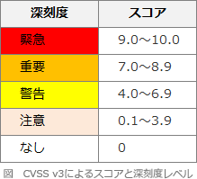

# [令和3年秋期 午前 問41](https://www.ap-siken.com/kakomon/03_aki/q41.html)

#問題 #テクノロジ #セキュリティ #セキュリティ技術評価

解説を表示解説を隠す

<strong>問41</strong>　基本評価基準，現状評価基準，環境評価基準の三つの基準で情報システムの脆弱性の深刻度を評価するものはどれか。

<ul class="ap-choices">
<li class="ap-choice-item ap-correct">

ア　CVSS

正しい。CVSSは、基本評価基準・現状評価基準・環境評価基準の3つで脆弱性の深刻度を評価するフレームワークです。

</li>
<li class="ap-choice-item ap-wrong">

イ　ISMS

Information Security Management Systemの略。情報セキュリティマネジメントシステムの整備・管理・運用に関する仕組みでJIS Q 27001(ISO/IEC 27001)の基となっています。

</li>
<li class="ap-choice-item ap-wrong">

ウ　PCI DSS

Payment Card Industry(PCI)データセキュリティ基準(DSS)は、カード会員のデータセキュリティを強化し、均一なデータセキュリティ評価基準の採用をグローバルに推進するためにクレジットカードの国際ブランド大手5社共同（VISA・MasterCard・JCB・AmericanExpress・Diners Club）により策定された基準です。

</li>
<li class="ap-choice-item ap-wrong">

エ　PMS

Personal information protection Management Systemの略。個人情報保護マネジメントシステムの整備・管理・運用に関する仕組みです。

</li>
</ul>

<h4>解説</h4>

CVSS(Common Vulnerability Scoring System：共通脆弱性評価システム)は、情報システムの脆弱性を評価するためのフレームワークです。ベンダーに依存しない共通かつ汎用的な方法が提供されているため、脆弱性の深刻度を同一の基準のもとで定量的に比較することが可能です。CVSSでは、次の3つの基準を順番に評価していき、最終的に脆弱性の深刻度を0（低）から10.0（高）のスコアで表します。算出されたスコアをもとに深刻度レベルを分類します。

基本評価基準（Base Metrics）脆弱性自体の深刻度を評価する指標。機密性・可用性・完全性への影響の大きさや、攻撃に必要な条件などの項目から算出され、時間の経過や利用者の環境で変化しない。ベンダーや脆弱性を公表する組織などが、脆弱性の固有の深刻度を表すために評価する基準となる

現状評価基準（Temporal Metrics）脆弱性の現在の深刻度を評価する指標。攻撃を受ける可能性や利用可能な対応策のレベルなどの項目から算出され、時間の経過により変化する。ベンダーや脆弱性を公表する組織などが、脆弱性の現状を表すために評価する基準となる

環境評価基準（Environmental Metrics）製品利用者の利用環境も含め、最終的な脆弱性の深刻度を評価する指標。二次被害の可能性や影響を受ける範囲などの項目から算出され、製品利用者ごとに変化する。利用者が脆弱性への対応を決めるために評価する基準となる

