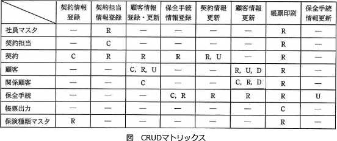

# [令和3年秋期 午前 問46](https://www.ap-siken.com/kakomon/03_aki/q46.html)

#問題 #テクノロジ #システム開発技術 #システム要件定義・ソフトウェア要件定義

解説を表示解説を隠す

<strong>問46</strong>　CRUDマトリクスの説明はどれか。

<ul class="ap-choices">
<li class="ap-choice-item ap-wrong">

ア　ある問題に対して起こり得る全ての条件と，各条件に対する動作の関係を表形式で表現したものである。

これはデシジョンテーブル(決定表)の説明です。

</li>
<li class="ap-choice-item ap-correct">

イ　各機能が，どのエンティティに対して，どのような操作をするかを一覧化したものであり，操作の種類には生成，参照，更新及び削除がある。

正しい。CRUDマトリクスの説明です。

</li>
<li class="ap-choice-item ap-wrong">

ウ　システムやソフトウェアを構成する機能(又はプロセス)と入出力データとの関係を記述したものであり，データの流れを明確にすることができる。

これはDFD(Data Flow Diagram)の説明です。

</li>
<li class="ap-choice-item ap-wrong">

エ　データをエンティティ，関連及び属性の三つの構成要素でモデル化したものであり，業務で扱うエンティティの相互関係を示すことができる。

これはE-R図の説明です。

</li>
</ul>

<h4>解説</h4>

CRUDマトリクス(クラッド図)は、システムで管理対象となっているデータがどの機能によって生成(Create)され、参照(Read)され、更新(Update)され、削除(Delete)されるかを表形式で一覧化したものです。Create、Read、Update、Deleteの4つの操作の頭文字を取ると「CRUD」になります。CRUDマトリクスを作成すると、データと機能およびデータ操作のタイミングの関係性を俯瞰的に把握することができるので、設計段階において処理の矛盾や漏れといった課題を発見することに役立ちます。

